# Sunflower Documentation

> Technical reference for the `SunFlowerAssistant` monorepo.
> For the narrative, screenshot-driven tour, see [`README.md`](README.md).
> For the rules that constrain contributions, see [`CLAUDE.md`](CLAUDE.md).

---

## Table of contents

- [Overview](#overview)
- [What It Does](#what-it-does)
- [Architecture](#architecture)
  - [Repository map](#repository-map)
  - [Two implementations, one idea](#two-implementations-one-idea)
  - [Electron process topology](#electron-process-topology)
  - [The IPC contract](#the-ipc-contract)
- [The voice pipeline](#the-voice-pipeline)
  - [Session state machine](#session-state-machine)
  - [Screen capture](#screen-capture)
  - [Local transcription (Whisper)](#local-transcription-whisper)
  - [The Ollama client](#the-ollama-client)
  - [Answer parsing and markers](#answer-parsing-and-markers)
- [Pointing](#pointing)
- [Guide mode](#guide-mode)
- [Sunflower-Code — the coding harness](#sunflower-code--the-coding-harness)
- [Sunflower Work — the errand runner](#sunflower-work--the-errand-runner)
- [The orb](#the-orb)
- [The Claude Code bridge](#the-claude-code-bridge)
- [Moods — contextual activity detection](#moods--contextual-activity-detection)
- [Surfaces and windows](#surfaces-and-windows)
- [The terminal interface](#the-terminal-interface)
- [Command-line tools](#command-line-tools)
- [Configuration reference](#configuration-reference)
- [The always-on budget](#the-always-on-budget)
- [Diagnostics: the watchdog](#diagnostics-the-watchdog)
- [Security and privacy model](#security-and-privacy-model)
- [The server (Cloudflare Worker)](#the-server-cloudflare-worker)
- [The Swift prototype (`apps/macos`)](#the-swift-prototype-appsmacos)
- [Build system](#build-system)
- [Environment variables](#environment-variables)
- [File reference](#file-reference)
- [Troubleshooting](#troubleshooting)

---

## Overview

Sunflower is a macOS screen companion. It lives in your menu bar, watches your
screen when you hold `⌃ ⌥` (Control + Option), and answers out loud. The model
doing the thinking runs on your own machine through
[Ollama](https://ollama.com) — no model provider, no per-token bill, no
screenshots leaving your Mac.

The repository contains **two implementations** of the same product, plus a
backend that only one of them uses:

| App | Path | Status | Inference | Transcription | Speech |
| --- | --- | --- | --- | --- | --- |
| **`sunflower`** (Electron) | `apps/electron` | **What actually runs** | local Ollama | local whisper.cpp (Metal) | macOS system voice |
| `Glide` (Swift/AppKit) | `apps/macos` | Earlier prototype, kept for reference | local Ollama, *via* the Worker | AssemblyAI (hosted) | Gradium (hosted) |
| `server` (Hono / Cloudflare Worker) | `apps/server` | Backend for the Swift app only | proxies local Ollama | issues AssemblyAI tokens | proxies Gradium |

Sunflower started as a fork of [Glide](https://github.com/shujanshaikh/glide),
which itself started as a clone of
[Clicky](https://github.com/farzaa/clicky). This version replaces the
hosted-model backend with local inference.

> **Read this first:** unless a section says otherwise, "Sunflower" in this
> document means the **Electron app** (`apps/electron`) — the one that runs
> 100 % locally with no server, no auth and no API keys. The Swift app and the
> Worker are documented separately at the end.

---

## What It Does

You hold a push-to-talk key (`⌃ ⌥`) and talk. Sunflower captures the screen
your cursor is on, sends the image plus your transcript to a local vision
model, streams the answer back, speaks it out loud, and can point at things on
screen with an on-screen bracket frame.

### Core features

| Feature | What it is | Lives in |
| --- | --- | --- |
| **Push-to-talk voice interface** | Hold `⌃ ⌥`, talk, release. Global hook via `uiohook-napi`. | `main/hotkey.ts` |
| **Screen capture & vision analysis** | JPEG of the display under the cursor, sent to a local vision model. | `main/screenshot.ts`, `main/ollama.ts` |
| **Cursor-following companion** | Pixel-art sunflower that follows the cursor with a speech bubble. | `main/windows/companion.ts`, `renderer/companion/` |
| **Screen pointing** | The model returns `[POINT:x1,y1,x2,y2]`; an orange bracket frame sizes itself to that element. | `main/guide-parser.ts`, `main/windows/pointer.ts` |
| **Guide mode** | Multi-step how-to plans (`[STEP:…]`) executed deterministically, no model calls between steps. | `main/guide-runner.ts` |
| **Terminal UI** | The launching terminal becomes a first-class interface: pixel banner, mode badge, slash commands. | `main/tui.ts`, `main/tui-pixel.ts`, `main/tui-ansi.ts` |
| **Sunflower-Code** | A local coding harness: 4 modes, 7 tools, 3 permission levels, and a context that renews itself without losing the task. | `main/code/`, `shared/code.ts` |
| **Sunflower Work** | An errand runner that drives mouse and keyboard while you're away. Opt-in. | `main/work/` |
| **The orb** | Right-edge badge showing the busy Code session or Work run. | `main/windows/orb.ts` |
| **Moods** | The flower gives itself an accessory matching the frontmost app. Event-driven, local. | `main/activity.ts`, `shared/activity.ts` |
| **Dock mode** | Pin the companion to a corner instead of chasing the cursor. | `main/windows/companion.ts` |
| **Watchdog** | Per-process CPU/RSS samples appended to a rotated JSONL log. | `main/watchdog.ts` |

---

## Architecture

### Repository map

```txt
apps/
  electron/   Electron screen companion "sunflower" — fully local
    bin/      sunflower, sunflower-models, sunflower-requirements CLIs
    scripts/  esbuild build, always-on budget check, native-log filter
    src/
      main/       Electron main process (Node)
      preload/    contextBridge → window.sunflower
      renderer/   one bundle per window surface (IIFE)
      shared/     types + pure logic, no electron / no node
  macos/      Native Swift/AppKit menu-bar app (earlier prototype)
  server/     Hono Cloudflare Worker API (used by the Swift app)
packages/
  config/     Shared TypeScript config (@piksy/config)
```

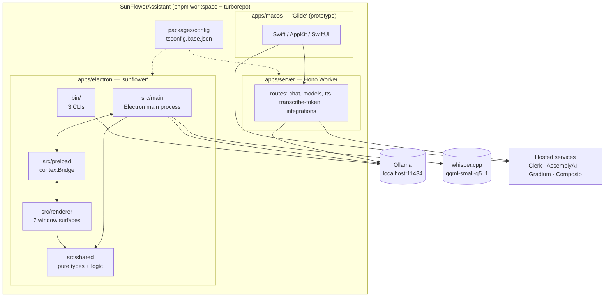

### Two implementations, one idea

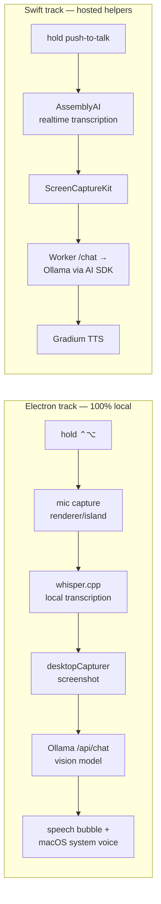

The Electron app needs **no server, no Clerk, no API keys**. The Swift app
needs a running Worker and a Clerk application; every one of its routes is
authenticated.

### Electron process topology

Seven renderer surfaces, all created by the main process. Overlays are
transparent, click-through, always-on-top and **excluded from Sunflower's own
screenshots** via `setContentProtection(true)` (`main/windows/common.ts`).

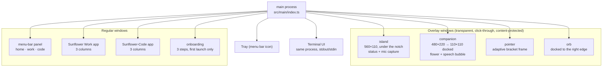

| Surface | Window type | Visibility rule |
| --- | --- | --- |
| `island` | overlay, 560×110, centred under the notch | hidden at `idle`, shown on any other state, 2 s grace before hiding |
| `companion` | overlay, 480×220 (110×110 docked) | always visible after onboarding; click-through except over the flower |
| `pointer` | overlay, resizable | 4 s per frame (`POINTER_MS`), or sticky during a guide |
| `orb` | overlay, focusable | only while a code session or work run is busy |
| `panel` | popover anchored to the tray | toggled by the tray click; self-sizes to its card height |
| `work` / `code` | regular windows | opened on demand; closing hides, state survives |
| `onboarding` | regular window | first launch only (`onboarded: false`) |

### The IPC contract

Every channel name lives in `shared/ipc.ts` under the `CH` constant, and the
whole renderer-visible surface is the `SunflowerBridge` interface exposed by
`preload/index.ts` as `window.sunflower`. Renderers have
`contextIsolation: true`, `nodeIntegration: false` — no direct Node access.

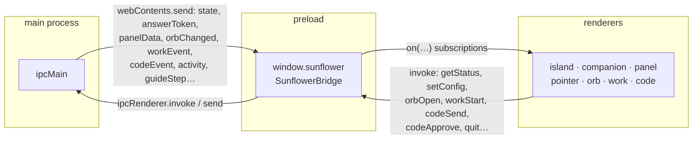

Channel families:

| Prefix | Direction | Purpose |
| --- | --- | --- |
| `sf:state`, `sf:answer-*`, `sf:point-show`, `sf:guide-step`, `sf:tts-*` | main → renderer | the live session |
| `sf:mic-*` | both | mic start/stop commands, PCM data back |
| `sf:panel-data`, `sf:activity` | main → renderer | status card, mood snapshot |
| `sf:orb:*` | both | the right-edge orb: status, hover, drag, click |
| `sf:work:*` | both | Sunflower Work sessions |
| `sf:code:*` | both | Sunflower-Code (single shared session — **no session id in any method**) |
| `sf:permissions:*`, `sf:config:*`, `sf:whisper:*`, `sf:app:quit` | renderer → main | setup and lifecycle |

---

## The voice pipeline

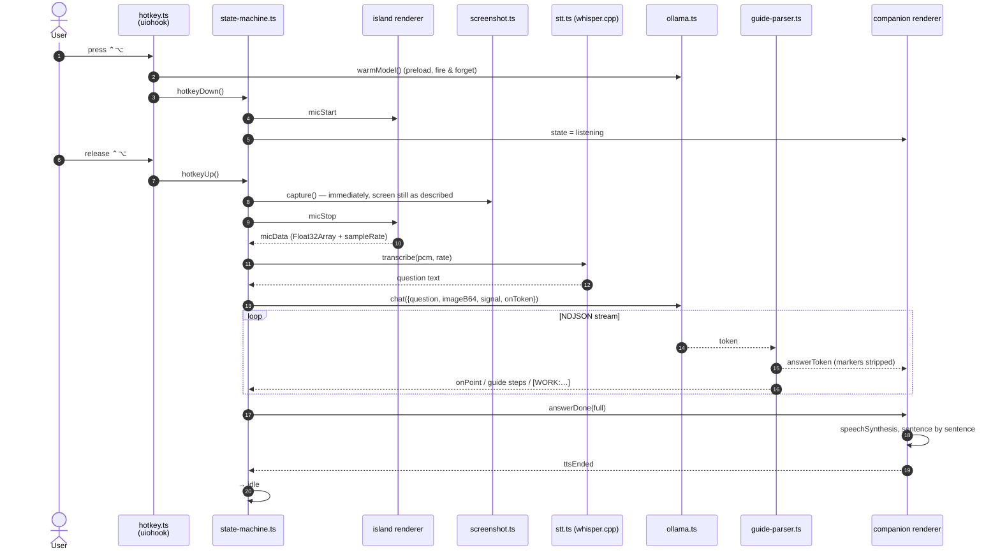

Key invariants enforced by `state-machine.ts`:

- **One flight at a time.** A monotonic `seq` counter tags each session; every
  async continuation checks `id === seq` before touching anything.
- **Capture happens on key release**, not after transcription — the screen is
  still in the state the user was describing.
- **`micData` is one-shot per session** (`micSeen === seq` guard): a duplicate
  or late-cancelled mic payload can never start a second run.
- **Minimum hold is 300 ms** (`MIN_HOLD_MS`); shorter presses are discarded.
- Timeouts: 10 s for the mic to deliver, 45 s for transcription, 90 s TTS
  failsafe (`TTS_FAILSAFE_MS`), 4 s error display (`ERROR_MS`).

### Session state machine

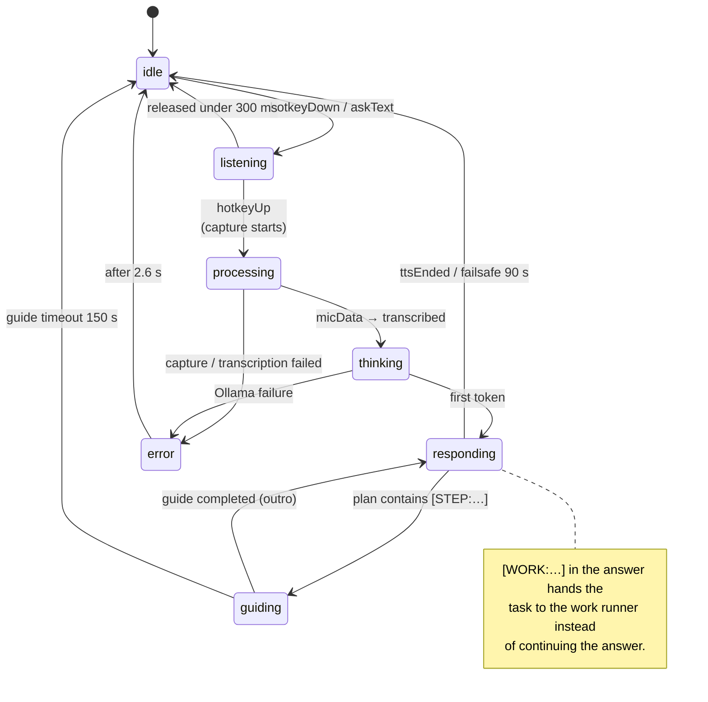

`AppPhase` (internal, 6 values) drives `IslandState` (displayed, 8 values) and
`CompanionPose` (drawn, 8 values) — see `shared/state.ts`.

| `AppPhase` | `IslandState` | `CompanionPose` |
| --- | --- | --- |
| `idle` | `idle` | `idle` |
| `listening` | `listening` | `listening` |
| `processing` | `reading` | `reading` (magnifier over a document) |
| `thinking` | `thinking` | `thinking` |
| `responding` | `answering` | `answering` / `pointing` |
| `guiding` | `guiding` | `pointing` |
| — | `acting` | `working` (work runs) |
| — | `error` | `idle` |

### Screen capture

`main/screenshot.ts` — `captureScreenAtCursor()`:

1. `screen.getCursorScreenPoint()` → `screen.getDisplayNearestPoint()`.
2. `desktopCapturer.getSources({types:["screen"], thumbnailSize: display.size})`.
3. Matches the source by `display_id`; falls back to `sources[0]` and records
   `displayMatched: false`.
4. Encodes JPEG quality 90 (inference cost depends on dimensions, not weight).
5. First successful capture flips `screenCaptureConfirmed` in the config — that
   survives the restart macOS demands after granting screen recording.

`displayMatched` is not cosmetic: **Sunflower Work refuses to run** when it is
false, rather than clicking on a display it cannot see.

### Local transcription (Whisper)

`main/stt.ts` wraps `smart-whisper` (N-API binding for whisper.cpp, Metal).

- Model: `ggml-small-q5_1.bin` (~190 MB), downloaded once from
  `huggingface.co/ggerganov/whisper.cpp` into
  `~/Library/Application Support/sunflower/models/`.
- Download is redirect-following (max 5), atomic (`.part` → rename), and
  reports progress 0–100 into `PanelData.stt.progress`.
- Audio is linearly resampled to 16 kHz and padded to at least 1.1 s
  (`MIN_PCM_SAMPLES = 17600`) — whisper.cpp refuses shorter buffers.
- On load, a silent buffer is transcribed as a warm-up.
- `NODE_ENV=production` is forced *only* around the `require`, which installs
  whisper.cpp's silent logger; the previous value is restored immediately.
- `SttStatus`: `ready · loading · downloading · absent · error · disabled`.

Native stderr noise (`whisper_*`, `ggml_*`) is filtered by
`scripts/native-log-filter.cjs` into
`~/Library/Application Support/sunflower/logs/native.log` (rotated at 5 MB).
`SUNFLOWER_DEBUG=1` disables the filter.

### The Ollama client

`main/ollama.ts` talks to `/api/tags`, `/api/ps` and `/api/chat` directly — no
SDK, no server.

| Constant | Value | Why |
| --- | --- | --- |
| `NUM_CTX` | `8192` | screenshot (~600–2500 visual tokens) + prompt + 700 answer tokens. Ollama's 4096 default truncates silently. |
| `NUM_PREDICT` | `700` | 1–3 sentence answers, or a full guide plan (≈450 tokens). |
| `KEEP_ALIVE` | `10m` | keeps the runner warm between questions. |
| `FIRST_TOKEN_WARM_MS` | `45_000` | model already in memory. |
| `FIRST_TOKEN_COLD_MS` | `180_000` | cold load, disk → RAM/VRAM. |
| `INTER_TOKEN_MS` | `30_000` | silence between tokens = failure. |
| `CONTEXT_RESET_TOKENS` | `10_000` | past this, start a fresh chat. |

**Model resolution.** `pickModel()` uses the configured `ollamaModel` if it is
pulled, otherwise **the first local model advertising the `vision`
capability** — the app must work with whatever you already have.

**Cold starts.** `isModelLoaded()` (`GET /api/ps`) decides which first-token
budget to arm and whether to emit `onStatus("loading-model")`, which the
terminal renders as `waking the model…`. `warmModel()` posts an empty
`messages: []` chat (the official Ollama preload pattern), deduplicated and
throttled to once per 30 s, with **the same `num_ctx` as real requests** —
otherwise Ollama restarts the runner on the first real question and the warm-up
is wasted.

**Context renewal.** Each question starts from an empty message list, but the
Ollama runner survives across questions (`keep_alive` + prompt cache), and with
small vision models that accumulated state degrades answers. `recordUsage()`
sums the real `prompt_eval_count + eval_count` Ollama reports; past 10 000
tokens `resetContext()` unloads the runner (`keep_alive: 0`), notifies the
terminal (`✦ … starting a fresh chat`) and re-warms in the background.

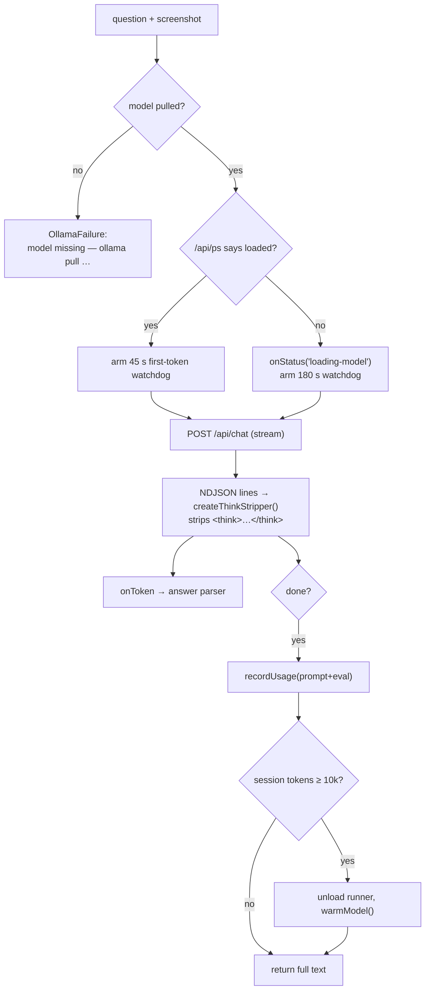

Error taxonomy: `OllamaUserInterrupt` (the user aborted — silent) versus
`OllamaFailure` (carries a `userMessage` shown on the island and spoken).

### Answer parsing and markers

`main/guide-parser.ts` is a **streaming** parser: markers never reach the
speech bubble or the voice, even when split across two chunks.

| Marker | Meaning | Handled by |
| --- | --- | --- |
| `[POINT:x1,y1,x2,y2]` | tight bounding box of one element to frame | pointer window |
| `[STEP:x1,y1,x2,y2] text` | guide step, advances on cursor proximity | guide runner |
| `[STEP:x1,y1,x2,y2:click] text` | target not on screen yet, advances on click | guide runner |
| `[STEP:click] text` | no position at all, advances on click | guide runner |
| `[DONE] text` | end of the plan + closing sentence | guide runner |
| `[WORK: description]` | this is an errand, hand it to the work runner | work runner |

**Coordinate normalisation.** The prompt asks for 0–1000 integers (the
grounding format `qwen3-vl` is natively trained on), but `normalizeMarker()`
also accepts:

- legacy two-number centres — `[POINT:50%,30%]` → default fixed frame,
- percentages (`%` suffix),
- 0–1 fractions,
- absolute pixels of the captured image (hence `Screenshot.imageSize`).

What it refuses to do is guess:

- a marker it cannot parse renders **nothing** (`GARBAGE` regex absorbs it),
- a box covering ≥ 85 % of **both** dimensions (`WHOLE_SCREEN_PCT`) is
  discarded as noise,
- a box under 0.4 % in either dimension (`DEGENERATE_PCT`) keeps its centre and
  drops its size,
- the system prompt itself tells the model to skip the marker when unsure.

Guides are capped at 8 steps (`MAX_STEPS`, prompt asks for 6) and 140
characters per spoken instruction (`MAX_STEP_CHARS`).

---

## Pointing

The frame draws **immediately** from the model's own box — pointing never waits
on a round-trip. A **double check** then refines it *in place*, treating the
first marker as a claim to improve rather than a gate.

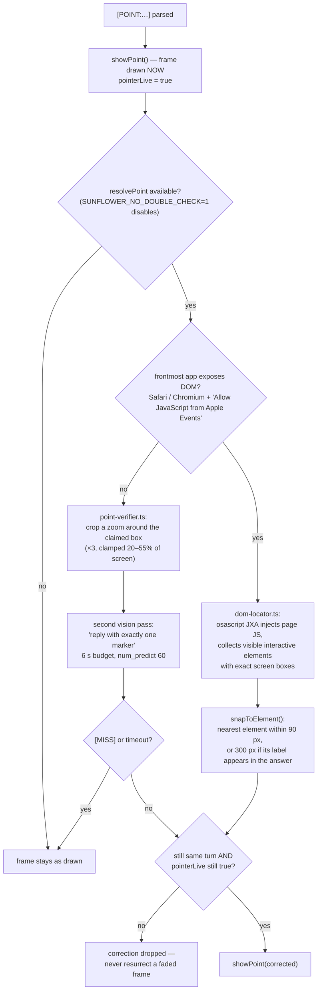

**Frame geometry** (`main/windows/pointer.ts`): constant-thickness pixel-art
brackets, 10 px padding (`FRAME_PAD_PX`), clamped between 60×48 px and 70 % of
the screen (`FRAME_MAX_FRAC`), always fully on screen. The window itself is
15 % larger than the frame so the scale-in animation is not clipped.

**Guide steps are different**: their targets are DOM-snapped from a *single*
snapshot **before** the step is drawn — visible-target steps only — so guide
execution stays deterministic with no extra model calls between steps.

Every fallback is silent and non-blocking. `SUNFLOWER_DEBUG=1` logs each
marker's raw text, the detected convention and the final frame rectangle.

---

## Guide mode

`main/guide-runner.ts` executes a plan **deterministically — no AI call between
steps**. Progression comes from geometry (cursor near the target) or a global
click; everything else is timing.

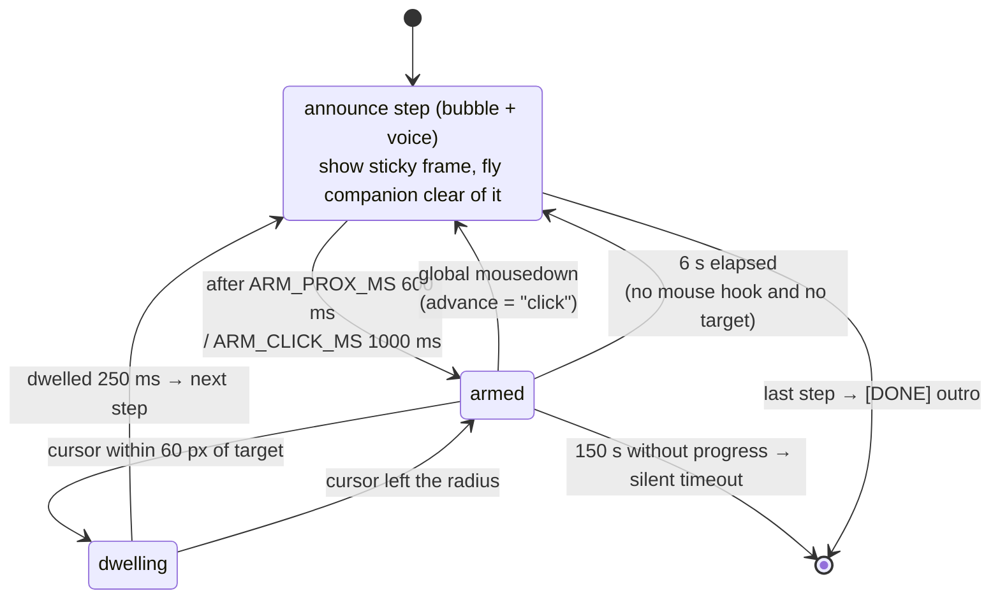

| Constant | Value | Role |
| --- | --- | --- |
| `PROX_RADIUS_PX` | 60 | absorbs the vision model's ±1–2 % imprecision |
| `DWELL_MS` | 250 | continuous stay before advancing |
| `ARM_PROX_MS` / `ARM_CLICK_MS` | 600 / 1000 | ignore proximity/clicks right after announcing |
| `PREV_TARGET_GRACE_MS` | 2500 | a click near the *previous* target finishes that action |
| `POLL_MS` | 50 | proximity poll — bounded to an active guide |
| `GUIDE_IDLE_MS` | 150 000 | guide dies quietly |
| `NO_HOOK_ADVANCE_MS` | 6000 | timed advance when Accessibility is unavailable |

When a step carries a box, the frame wraps the whole element and the companion
parks clear of it (`flyTo({clearance})`, `FLY_CLEARANCE_MARGIN = 24`).
A question typed during a guide cancels it and starts a normal turn.

---

## Sunflower-Code — the coding harness

A port of [Ollama-Code](https://github.com/Tromset/Ollama-Code)'s
infrastructure living inside Sunflower, running against the same local Ollama.

**There is exactly one entry point** — `routeToCode()` in `main/index.ts` — so
there is exactly one place to look to know where a message went. Both the
terminal (`code ❯` prompt) and the dedicated window go through it, and there is
**one session**, shared: no method in the IPC surface takes a session id.

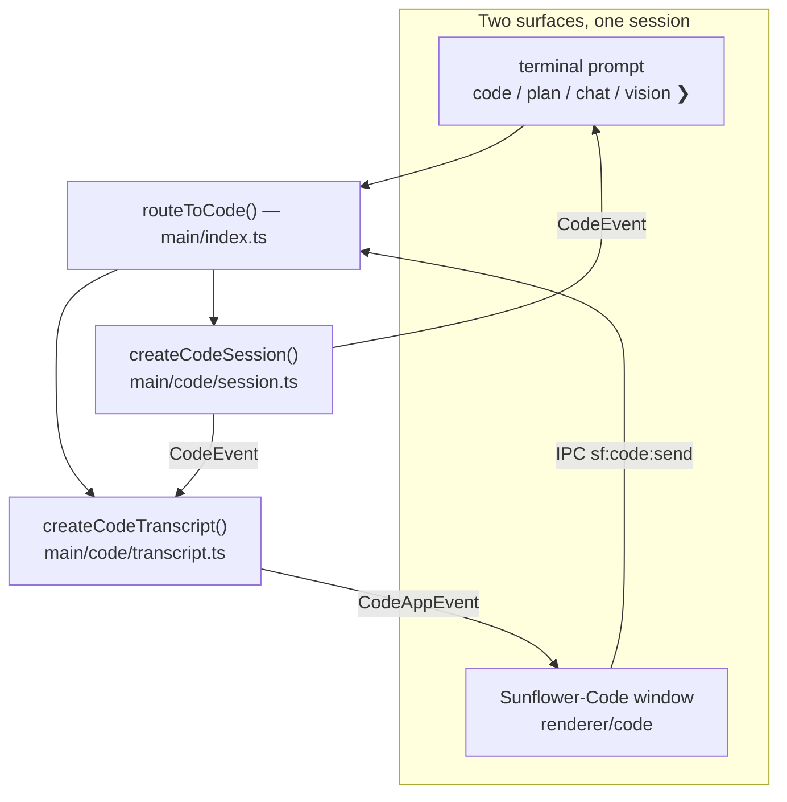

### The agentic loop

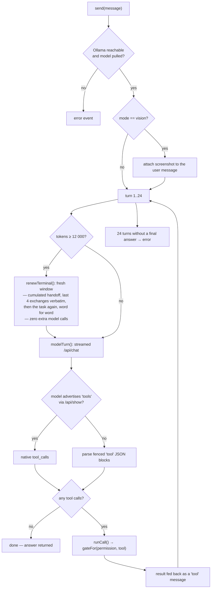

**Two tool dialects, one code path.** `supportsNativeTools(model)` caches the
answer from `POST /api/show`. If the model advertises `tools`, Ollama's native
tool interface is used; otherwise the system prompt describes a text protocol —
one fenced `tool` block holding `{"name": …, "args": {…}}` — and
`parseTextToolCalls()` produces the same `CodeToolCall`. Nothing downstream
knows which one served.

**Modes** (`CodeMode`):

| Mode | Toolbox | Notes |
| --- | --- | --- |
| `code` | all 7 tools | the full workshop |
| `chat` | none | answers from the conversation alone |
| `vision` | all 7 tools | a screenshot is attached to the message |
| `plan` | read-only | investigate, then write out a numbered plan |

**Tools** (`CodeToolName`), all confined to one project folder:

| Tool | Effect | Bounds |
| --- | --- | --- |
| `read_file` | read | 60 000 bytes, optional 1-based `start`/`end` |
| `list_files` | read | 400 entries, depth 0–8 (default 3), skips `node_modules`, `dist`, `.git`… |
| `search` | read | regex, 80 hits, 3000 files scanned, skips files > 1 MB and binaries |
| `write_file` | write | 400 000 bytes max; re-reads the file first so the app can show a real diff |
| `edit_file` | write | exact snippet, must appear **exactly once** |
| `move_file` | write | rename/move inside the folder, refuses to overwrite |
| `bash` | execute | cwd locked to the folder, 180 s timeout, process-group kill, blacklist |

**Path safety** (`resolveInside()`): an absolute path, a `..`, or a basename in
`SECRET_FILES` (`.env`, `.env.local`, `.npmrc`, `.netrc`, `id_rsa`,
`id_ed25519`, `.dev.vars`) is refused *before* anything is opened.

**Permission levels** (`CodePermission`) — the gate matrix from
`shared/code.ts`, which the app's left column renders by calling the very same
`gateFor` / `toolsFor` functions the harness calls:

| Level | read tools | write tools | `bash` |
| --- | --- | --- | --- |
| `plan` | allow | **deny** | **deny** |
| `normal` *(default)* | allow | **ask** | **ask** |
| `yolo` | allow | allow | allow |

The **mode can restrict further but never widen**: `plan` mode is read-only
even under `yolo`, and `chat` exposes no tools at all whatever the level.

**Bounds** (`shared/code.ts` + `main/code/session.ts`):

| Constant | Value |
| --- | --- |
| `CODE_MAX_TURNS` | 24 turns per user request |
| `CODE_COMPACT_AT_TOKENS` | 12 000 → a fresh terminal |
| `MAX_CALLS_PER_TURN` | 4 (extras are refused **loudly**, never silently truncated) |
| `NUM_CTX` / `NUM_PREDICT` | 16 384 / 2048 |
| `FIRST_TOKEN_MS` / `INTER_CHUNK_MS` | 300 s / 90 s |
| `MAX_TOOL_RESULT` / `MAX_TOOL_DISPLAY` | 20 000 / 1200 chars |
| `MAX_TASK_CHARS` / `MAX_HANDOFF_CHARS` | 4 000 / 2 000 chars across a seam |
| `HANDOFF_TAIL_MESSAGES` / `MAX_TAIL_CHARS` | 4 exchanges verbatim, 800 chars each |

**Changing terminal keeps the task.** Like Work, the harness calls a renewed
context window a *terminal*, and `renewTerminal()` (`main/code/session.ts`)
builds the new one out of three pieces, in this order:

1. the **handoff** — the tools run and the last answer *of the window being
   closed*, prefixed with the previous handoff (`(earlier) …`), so terminal 4
   still knows what terminal 1 did, without repeating it;
2. the **last four exchanges verbatim** (truncated, images dropped) — a summary
   says what was done, this carries the exact paths and symbol names;
3. **the task prompt itself, word for word and last** — the user message
   object, so a `vision` screenshot crosses with it.

That third piece is the whole point: the old `compact()` replaced the message
list with a summary quoting `visible.find(role === "user")`, i.e. the *first*
request of the session — so a second task, renewed mid-flight, lost its own
prompt and inherited someone else's. Renewals cost **zero extra model calls**;
they stay instant and deterministic. `CodeSessionInfo.terminal` carries the
1-based number, and both surfaces show the seam (`fresh terminal 2, the task
carries over` in the CLI, `✦ 12.0k tokens — terminal 2, task kept` in the app)
instead of hiding it.

**Approvals** are single-in-flight but **two surfaces can answer**. The waiter
carries the `callId`: the terminal answers without one (it can only reply to
the prompt it just printed), the window answers with it, so a click landing on
an already-settled approval does nothing instead of deciding the next one.

**The window** (`renderer/code/`, `main/windows/code.ts`) has three columns:

- **left — what it may do**: mode and permission pills, the project folder, the
  live gate for all seven tools, plus turn/token meters against the real
  ceilings and the terminal you are in.
- **middle — what it is saying**: streaming answer, inline tool calls
  (`▸ read_file src/x.ts` → `✓ 42 lines · 12 ms`), raw command output, a rule
  where one terminal handed over to the next. A pending approval raises a banner **pinned
  above the composer**, showing an `edit_file` diff *before* you allow it.
- **right — what it changed**: every file written this session, newest first,
  with a real before/after diff. **Only the diff crosses IPC — never file
  contents** (`shared/diff.ts`, bounded LCS, `DIFF_MAX_LINES = 300`).

`main/code/transcript.ts` is the app's memory (the terminal keeps nothing):
600 entries, 20 000 chars of raw output per call, 200 000 chars of in-flight
draft. All in memory — a coding conversation never touches disk.

The window costs nothing at rest: no timer, no poll, no `requestAnimationFrame`
— every pixel moves because an event arrived.

---

## Sunflower Work — the errand runner

Sunflower can drive mouse and keyboard to finish a computer errand — "archive
the newsletters", "close all these tabs". It **starts right away** and hands the
cursor back the moment you touch the machine. It is **off by default**
(`sunflowerWorkEnabled: false`).

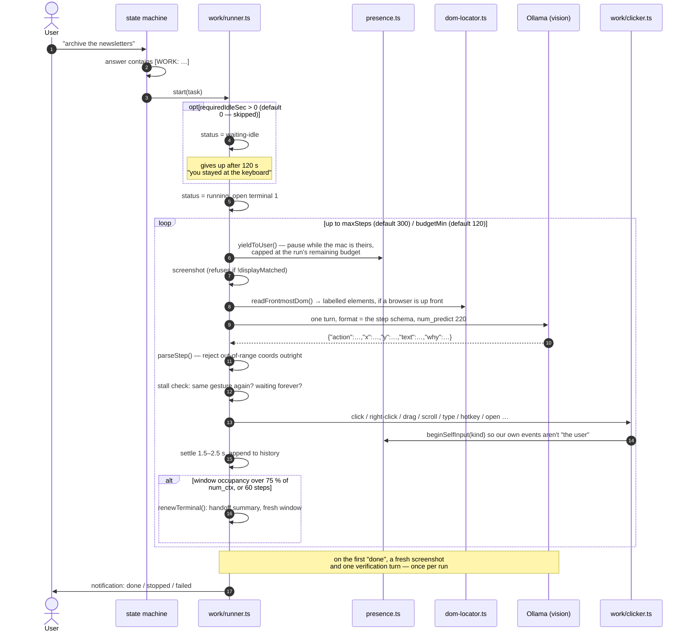

**Why it is tenable for hours on a local model — the two mechanisms:**

1. **The terminal renews itself.** A window is renewed when its **occupancy**
   passes 75 % of `num_ctx`, or after `TERMINAL_BUDGET_STEPS = 60`. When one
   fills, the runner writes a handoff summary of the last 8 steps and opens a
   fresh window. The Work app shows the seams (`terminal 2 · 4 800 tokens`)
   instead of hiding them.

   *Occupancy* is the load-bearing word, and it was got wrong for a while.
   Every turn is a **stateless** request that re-sends the system prompt, the
   history and a whole screenshot, so `prompt_eval_count` is the size of the
   *current prompt*, not what the window has gained. Accumulating it charged a
   full image per step: the old fixed 5 000-token ceiling was reached after two
   or three gestures, the terminal renewed itself constantly, and each renewal
   also **unloaded the model** — so the next turn paid a cold reload, often
   longer than its own timeout. One unit bug that looked like three faults: it
   only ever clicked, it stalled for ages, it opened terminals non-stop. The
   runner now compares the current prompt against the real window, and nothing
   is unloaded mid-errand.
2. **The chatbox is not decoration.** Anything you write mid-run is drained by
   `store.drainGuidance()` and handed to the model on its next turn, *above*
   its own plan.

**The action contract.** The model must reply with exactly one JSON object.
`main/work/actions.ts` is the single registry behind it — the accepted names,
the fields each one requires, the grammar lines in the system prompt, the JSON
Schema passed to Ollama in `format`, and the history line all derive from it.
The dispatch is an exhaustive `switch`, so a new action with no branch is a
compile error rather than (as it once was) a silent key press.

| Action | Needs | What it does |
| --- | --- | --- |
| `click` | x, y | one left click |
| `double-click` | x, y | two left clicks |
| `right-click` | x, y | the context menu |
| `type` | x, y, text | click to focus, then type — long text goes via the clipboard and ⌘V |
| `key` | text | one bare key from a 16-name whitelist |
| `hotkey` | text | a combination: `cmd+c`, `cmd+shift+t`, … |
| `scroll` | x, y, text | a real wheel under the cursor; `amount` = wheel clicks |
| `drag` | x, y, x2, y2 | press, move, release |
| `open` | text | an app name or an http(s) URL, through `open-guard.ts` |
| `click-label` | text | click the element with that label, from the DOM reading |
| `wait` | — | nothing, for a moment |
| `done` | — | end the run |

`parseStep()` rejects the reply outright if any coordinate falls outside
`[0,1]` — clamping toward a screen-edge click that has nothing to do with the
target would be worse than retrying. It also validates the three arguments the
model writes out in words (key name, combination, scroll direction), so a
typo costs a replayed turn instead of killing the run. Four consecutive
unusable replies — off-format, or not delivered in time — end it
(`MAX_BAD_REPLIES = 3`).

**Aiming.** `dom-locator.readFrontmostDom()` — already used to snap the voice
assistant's pointer — reads the frontmost browser's interactive elements as
labelled boxes in global points. Work attaches up to 40 of them to each turn,
so the model can name a target with `click-label` instead of guessing
coordinates off a JPEG. Outside a browser the reading returns nothing and the
image is all there is.

**Not getting stuck.** Three guards, all added because "it goes quiet" is
indistinguishable from "it is thinking" from the outside:

- a slow turn **replays** the turn instead of ending the run (a cold model load
  gets `COLD_START_MS = 180 s`, versus `firstTokenMs` for a warm one);
- the same gesture repeated, or `wait` returned over and over, first earns a
  nudge in the next prompt and then stops the run **saying so**;
- the first `done` is checked against a fresh screenshot in one extra turn —
  once per run, so a run can always terminate.

**What `open` will not open.** `work/open-guard.ts` is pure and blunt: http and
https only (`file:`, `javascript:`, `ssh:` and friends are ways of launching
something else), app names matched against `/^[A-Za-z0-9 .+-]{1,40}$/` with no
path, and a blocklist of terminals, system settings, the keychain, script
runners and system utilities — compared on a name flattened to letters and
digits, so `iTerm 2`, `iterm2` and `Terminal.app` are all the same refusal. A
refused target never ends the run: it is recorded as a failed call, told back
to the model, and the next turn tries something else.

**The presence guard.** `main/presence.ts` tracks the last **real** input.
`work/clicker.ts` wraps every synthetic burst in `beginSelfInput(kind)` with a
350 ms grace, **per input family** — a mouse burst must not deafen the keyboard
guard, or a user returning during a multi-second System Events typing burst
would only be noticed afterwards. Typing is split into 40-character chunks so
the guard re-arms roughly every second.

Anything cancels a run instantly: real input, the push-to-talk hotkey, the
panel/tray toggle, `Ctrl+C`, app quit. Work **refuses to start** without the
Accessibility grant (`mouseHookAvailable()`), rather than drive blind, and it
is macOS-only.

**Input synthesis, zero npm dependencies.** `work/clicker.ts` spawns
`/usr/bin/osascript`: JXA + the ObjC bridge posts real CGEvents
(`CGEventCreateMouseEvent`, `CGEventCreateScrollWheelEvent2`, `CGEventPost` on
`kCGHIDEventTap`) in **global points** — the same frame as Electron displays,
not the pixels of the capture. Typing and combinations go through System Events
(`keystroke` / `key code`, with `using: {command down, …}`), and text, key names
and modifiers are always passed as arguments, never interpolated into a script.

The scroll wheel is worth a note, because the code used to say it was
impossible. `CGEventCreateScrollWheelEvent` is **variadic**, and JXA's ObjC
bridge cannot call a variadic reliably — which is why scrolling was routed
through `pagedown`/`pageup` instead. `…ScrollWheelEvent2` takes six fixed
arguments and goes through fine, so the wheel is real now, with the key press
kept as a fallback if the script ever fails.

**Settings** (`shared/work.ts`, clamped server-side by `clampWorkSettings`):

| Setting | Default | Range |
| --- | --- | --- |
| `requiredIdleSec` | **0** (start now) | 0 – 300 |
| `budgetMin` | 120 | 0 – 720 (`0` = no time limit) |
| `maxSteps` | 300 | 5 – 2000 |
| `onUserInput` | `pause` | `pause` \| `stop` |

`requiredIdleSec: 0` is the default and a legitimate value: a run no longer
waits for an empty desk. What makes that liveable is `onUserInput: "pause"` —
the session yields, and resumes on its own after a 2 s lull. A step decided
while you were typing is **thrown away** rather than clicked, since the
screenshot behind it is stale. A pause is capped at the run's remaining time
budget, so a session paused in front of someone who keeps working expires
honestly instead of sitting on the queue forever.

**Session lifecycle:** `queued → [waiting-idle] → running ⇄ paused → done |
aborted | failed`. Several errands can be queued; they run one at a time,
because they share one mouse. The store keeps 30 sessions, 500 log lines, 400
calls and 200 chat messages each.

**The Work app** (3 columns): create/list runs · tool calls + terminal ·
chatbox + limits. It is a real window, excluded from Sunflower's captures so a
run never ends up commenting on its own interface.

---

## The orb

A small pixel sunflower docked to the right edge of the screen, visible only
while **Sunflower-Code** or **Sunflower Work** is busy. It is the only sign of
life when neither app has a window open.

The main process translates both runners into one neutral payload
(`shared/orb.ts`) so the renderer never has to know either feature's state
model:

```ts
interface OrbRun {
  id: string;
  source: "code" | "work";
  title: string;   // project folder for Code, task for Work
  state: string;   // already-written text: "turn 3/8 · thinking…", "step 12"
  active: boolean; // the disc is lit
  working: boolean; // a model call or tool is actually in flight
}
```

`refreshOrb()` in `main/index.ts` rebuilds that list from
`codeSession.info()` and the active Work sessions, then pushes it over
`sf:orb:changed` and shows or hides the window. It runs from events the two
runners already emit — the code session's `onEvent` and the work runner's
`onSessionsChanged`/`onFinished` — so **the orb has no timer of its own**.
Token bursts don't repaint anything: the derived payload is compared against
the last one sent and identical states are dropped.

`working` is deliberately narrower than `active`: an approval prompt or a
paused errand leaves the disc lit but stops the ring animation, so movement
always means the machine is doing something rather than waiting on you.

Hovering expands the status pill (the main process widens the window; the pill
lays out to the left). Dragging repositions it, persisted as `orbY`. A plain
click — as opposed to a drag, separated by a 3 px threshold — opens the app the
badge is currently showing.

---

## The Claude Code bridge

You launch a long task in Claude Code, switch to something else, and then keep
going back to the terminal to see whether it is done. The flower is already on
the desktop; it can just tell you.

When the bridge is on, Sunflower follows the Claude Code sessions running on the
same Mac and, **the moment one of them finishes, the flower emits three orange
rings and a two-note chime**. That is the whole notification: no speech bubble,
no Notification Center, no orb badge.

The colour is not a coincidence — `--orange` (`#D97757`) has been described in
`renderer/shared/tokens/colors.css` as *"the Claude clay-orange accent"* since
long before this feature existed.

### Where the signal comes from

Claude Code can run a command on its own lifecycle events. Sunflower registers
a short `/bin/sh` script for five of them; the script drops the event's JSON
payload into a spool directory, and `fs.watch` wakes the app.

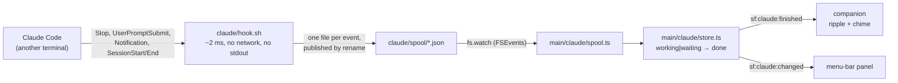

**Nothing polls.** This is the fifth "watch the environment continuously"
temptation in this repository and the first one that never had to be talked out
of it: the events are pushed by Claude itself. When Claude is not running,
**not one line of this module executes** — which is why the feature adds
**zero entries** to `scripts/loop-budget.json` and leaves both ceilings at
`2` and `1`.

The alternative — tailing `~/.claude/projects/**/*.jsonl` and guessing what
"finished" means from the last entry — was rejected: it needs a quiet-window
timer, and it is a guess where the hook is a fact.

### The five events, and the two that were refused

| Event | Matcher | Why |
| --- | --- | --- |
| `Stop` | — | **This is "Claude finished".** One per assistant turn. |
| `UserPromptSubmit` | — | Puts the task back to `working`, so the *next* `Stop` is a real edge. Without it, turn 2 of a session would never ripple. |
| `SessionStart` | `startup\|resume\|clear` | Creates the task with its folder. `compact` is excluded — it fires over and over during a long task. |
| `Notification` | `permission_prompt\|agent_needs_input` | The `waiting` state. `idle_prompt` is excluded: it arrives *after* a `Stop` already handled. |
| `SessionEnd` | — | Removes the task instead of leaving a ghost in the panel. |

**`SubagentStop` is deliberately not registered.** One turn can spawn a dozen
subagents finishing seconds apart — a process each, a ripple storm, and worst
of all a *lie*, since they finish while Claude is still working.

Steady-state cost per Claude turn: **two short `sh` processes**, in Claude's
process tree, only while Claude runs.

### What it writes, and how to undo it

Enabling adds one group per event to `~/.claude/settings.json`. That file
belongs to the user, so the module is the most defensive in the repository:

- an entry is Sunflower's **iff** its command contains `sunflower/claude/hook.sh`
  — no field is added to Claude's schema, no foreign group is ever merged into
  or reordered;
- **invalid JSON means no write at all.** People put comments in that file;
  refusing is the only safe answer;
- symlinks are resolved first, so a `~/.claude/settings.json` pointing into a
  dotfiles repo is never replaced by a regular file;
- the file is copied once to `claude/settings-backup.json` before the first
  write, and its size + mtime are re-checked immediately before the rename, so
  a concurrent write by Claude Code is refused rather than clobbered;
- **it only ever writes on an explicit gesture** — the tray checkbox, `/claude
  on|off`, or the panel. Never at startup, never at quit, never as a silent
  repair.

The installed command is guarded:

```sh
[ -x '…/sunflower/claude/hook.sh' ] && '…/sunflower/claude/hook.sh' || true
```

so if Sunflower's data directory is ever deleted while the block survives, the
hook is a silent no-op instead of printing a failure inside every Claude turn.

Four ways to switch it off, all equivalent:

1. untick the tray item — removes the block, the script and the spool;
2. `/claude off` in the terminal;
3. edit `~/.claude/settings.json` by hand, or set `"disableAllHooks": true`;
4. `rm -rf "~/Library/Application Support/sunflower/claude"` — the `[ -x ]`
   guard makes the leftover block harmless.

**Claude Code reads its hooks when a session starts**, so a session that was
already open will not ripple. Enabling says so rather than looking broken.

### Reading the state

`/claude` prints whether the bridge is on, what the hooks actually look like,
and the sessions seen so far. The setting is the record of *intent* and
`status()` is the ground truth; when they disagree — hooks edited by hand, data
directory wiped — the gap is **shown**, never silently repaired.

| State | Meaning |
| --- | --- |
| `no-claude` | no `~/.claude`: Claude Code isn't installed |
| `absent` | nothing of ours in the settings |
| `installed` | all five events registered |
| `partial` | some only — hand-edited; tick again to repair |
| `stale` | our entries are there, our script is gone |
| `disabled` | `"disableAllHooks": true` |
| `unreadable` | invalid JSON or no permission — left untouched |

### Why this isn't a third task system

Commit `6928ca9` deleted the "agents" feature because *"keeping all three meant
three answers to the same question"*. That question was **"how does Sunflower
run a task for you"** — and this module does not answer it. Sunflower never
sends anything to Claude; the bridge is read-only, and the right comparison is
`activity.ts`, a sensor, not `work/runner.ts`, a runner.

`WorkSession` cannot be reused without becoming a lie: its documented contract
is *sole writer* (a Claude session is written by a process Sunflower cannot
see), its API is all steering — `workCancel`, `workChat`, `openTerminal` — and
its `queued()` list feeds the Work runner's `pump()`, so a Claude session
parked there would be **picked up and executed by Sunflower Work**.

`OrbSource` is untouched, and stays `"code" | "work"`. `shared/orb.ts` was
deliberately built source-agnostic, so a third member is cheap the day someone
wants Claude runs on the right-edge badge. This version doesn't spend it: the
ripple is the notification.

---

## Moods — contextual activity detection

When the flower has nothing else to do, it gives itself an accessory matching
whatever app is in front of you.

| Family | Trigger examples | Prop |
| --- | --- | --- |
| `music` | Deezer, Spotify, Apple Music, Tidal · `spotify.com`, `deezer.com` | headphones |
| `coding` | Cursor, VS Code, Xcode, terminals, JetBrains · `github.com`, `stackoverflow.com` | little laptop |
| `ai` | Claude, ChatGPT, Gemini, Ollama, LM Studio · `claude.ai`, `chatgpt.com` | "AI" placard |
| `streaming` | Netflix, YouTube, Twitch, IINA · `youtube.com`, `netflix.com` | popcorn |
| `creative` | Figma, Premiere Pro, Photoshop, Blender, Logic · `figma.com` | plaid blanket, hunched over |
| `messaging` | Snapchat, Discord, Slack, Messages, Teams · `discord.com` | phone with messages flying |
| `doomscroll` | TikTok, Instagram, Threads, X, Reddit · `tiktok.com` | phone, wilted petals, slow "zzz" |
| `none` | anything unrecognised | no prop rather than a wrong one |

Classification (`shared/activity.ts`, dependency-free and testable) is exact
name match first, then a length-≥5 substring fallback (`Visual Studio Code -
Insiders` stays coding). **For a browser the site decides, not the app** —
Chrome on `netflix.com` is streaming.

**Nothing polls.** This is the fourth "watch the environment continuously"
feature in this repository and the fourth one that made a Mac hot; the first
version forked an `osascript` every 4 seconds (~900 processes an hour, each
enumerating every app over Apple Events, on by default). What replaced it:

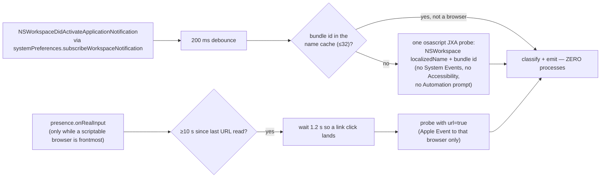

Guarantees: only a **family change** emits (tab-hopping on YouTube doesn't
re-flash the popcorn); a failed probe **keeps the previous prop** rather than
flickering; 5 consecutive failures give up for the session
(`MAX_HARD_FAILURES`); Automation refusals are remembered per bundle
(`urlDenied`) and never re-asked; the watcher stops entirely when the companion
is hidden or `moodsEnabled` is unticked. Nothing is written to disk, nothing is
sent to the model, nothing leaves the Mac.

A mood **only ever shows at idle**: the moment a question, guide, code session
or work run has something to say, the real pose wins.

---

## Surfaces and windows

### The companion

Two modes, persisted as `companionMode`:

- **`follow`** — chases the cursor, bubble on the right (or left near the right
  edge, `CH.flip`).
- **`docked`** — a compact ~110×110 badge parked in the bottom-right of the
  work area, with a scaled-down bubble. The tracking loop **stops entirely**.

Toggled by double-clicking the flower, the panel's roam/dock control, or the
tray menu — all three paths go through `setCompanionDocked()` so they stay in
sync. A docked companion re-pins itself on `display-metrics-changed`.

**The tracking loop** is the single most-tuned piece of the app, because it
caused the original "this app is heating up my Mac" report:

| State | Cadence |
| --- | --- |
| cursor moving | `FAST_MS = 33` (~30 fps) |
| cursor still ≥ 3 s | `SLOW_MS = 166` (~6 Hz) |
| docked / hidden / `hold` | **loop stopped** (`setLoop(null)`) |
| target position unchanged | `setBounds` **skipped** (`placed` cache) |

Decorative animations (sway, blinking caret, every mood keyframe) pause after
60 s of *real stillness* — the rule is a **wildcard** over everything the
flower carries, so the next decorative animation is covered without anyone
remembering to add it.

The window is click-through everywhere except the flower itself: `forward:
true` lets the renderer see `mousemove`, and hovering the flower flips
`setIgnoreMouseEvents` just long enough for the double-click to land.

### The menu-bar panel

Four tabs: **home** (permissions, model, voice, moods toggle, roam/dock),
**work ↗**, **code ↗**. The footer's **quit** is a real button:
`shutdownEverything()` cancels the running errand, the
Sunflower-Code session, the voice, the mood watcher and the Work/Code windows
before the app exits.

The panel **sizes its window to its own card**: the renderer measures the
card's natural height and `resizePanel()` follows, clamped to the screen with
room for the shadow; past that clamp the view scrolls *inside* the card, so the
rounded bottom corners are never cut off.

### Onboarding

Three steps on first launch: welcome → permissions → local model. Closing it
without finishing quits the app. `onboardingDone()` sets `onboarded: true`,
shows the main surfaces and kicks off the Whisper download.

**Permissions** (`main/permissions.ts`), all granted to the Electron binary:

| Id | Source of truth |
| --- | --- |
| `microphone` | `systemPreferences.getMediaAccessStatus("microphone")` |
| `accessibility` | `isTrustedAccessibilityClient(false)` — required for the global hotkey and the presence guard |
| `screen` | `getMediaAccessStatus("screen")` |
| `screenContent` | screen granted **and** a capture actually succeeded (`screenCaptureConfirmed`) |

Screen recording has a macOS quirk: its Settings pane only lists an app *after*
it has attempted a capture, and there is no "+" button. So the first "grant"
click **attempts a capture** to register the app and trigger the system prompt;
a second click opens the now-populated pane.

---

## The terminal interface

When launched from a terminal, Sunflower turns it into a first-class interface
— the same black-and-yellow, the same pixel sunflower as the windows, drawn in
the terminal itself (`main/tui.ts`, `tui-pixel.ts`, `tui-ansi.ts`; zero
dependencies, hand-rolled ANSI).

- **The banner draws the real sunflower**: the very pixel art the app renders as
  SVG (`shared/sunflower-pixels.ts`) rasterised into half-block characters
  (`▀`, one glyph carrying two pixels, doubled horizontally so pixels come out
  square) in 24-bit colour, beside a rounded status card
  (`╭─ ✿ sunflower ─── v0.1.0 ─╮`).
- **Degradation ladder**: truecolor → shape-only blocks → plain `[sunflower]`
  log lines when there is no TTY (the packaged app changes nothing else).
- **A mode badge sits in the prompt.** `ask ❯` talks to the screen companion;
  `code ❯` / `plan ❯` / `chat ❯` / `vision ❯` talk to Sunflower-Code.
- **Typing a question** takes a screenshot at your cursor and runs the exact
  same pipeline as voice — answer streams into the terminal *and* the companion
  bubble with speech. It works while Whisper is still downloading.
- **`Ctrl+C`** interrupts the current answer, the current Sunflower-Code turn
  *and* any work run; at an idle prompt it quits.

### Slash commands

| Command | What it does |
| --- | --- |
| `/help` | the command card |
| `/mode <ask\|code\|chat\|vision\|plan>` | who answers what you type |
| `/permission <plan\|normal\|yolo>` | what Sunflower-Code may do on its own |
| `/cd <folder>` | Sunflower-Code's project folder (clears the conversation) |
| `/code` | open the Sunflower-Code window |
| `/model [name]` | show or switch the local model |
| `/status` | the status card again |
| `/clear` | forget the conversation and clear the screen |
| `/work <task>` | hand a computer chore to Sunflower Work |
| `/claude [on\|off]` | the Claude Code bridge: state and live sessions, or the switch |
| `/quit` (or `/exit`) | full shutdown |

---

## Command-line tools

Four bins, all registered by `npm link` from `apps/electron`.

### `sunflower`

```bash
sunflower              # launch the app
sunflower code         # launch with the Sunflower-Code window open
sunflower models …     # dispatches to sunflower-models, no build needed
sunflower requirements # dispatches to sunflower-requirements
```

Self-sufficient from a fresh clone: if Electron cannot be resolved it walks up
to `pnpm-workspace.yaml`, runs `pnpm install` itself, then builds. The build
sentinel is `dist/.build-ok`, written **only at the very end** of a build, so
an interrupted or partially failed build triggers a rebuild.

`sunflower code` is translated to an explicit `--open-code` flag before being
handed to Electron — `main/index.ts` does not guess what a bare argument named
"code" means. If the app is already running, the second instance dies on the
single-instance lock but its `argv` arrives via `second-instance` and the
window opens anyway.

### `sunflower-code`

The coding harness, launchable from any folder.

```bash
sunflower-code                       # harness on the current folder
sunflower-code --cd ~/other-project  # aim elsewhere without moving
```

A shim over `bin/sunflower.js`: it appends `--cd $PWD` unless you passed one,
so the project folder is where you launched it rather than wherever the app
happened to start. Electron resolution, the rebuild-if-needed check and the
native-log filtering all stay in the one place that already does them.

`--cd` is read by `workdirFromArgv()` in `main/index.ts`, on both the first
launch and the `second-instance` path, so aiming at another project while the
app is already running moves the harness instead of being ignored.

### `sunflower-models`

Browses what is pulled locally and changes which model Sunflower uses, without
opening the app.

| Invocation | Behaviour |
| --- | --- |
| *(no args)* | interactive arrow-key browser: **Installed** (from `GET /api/tags`) + a curated **Recommended** list |
| `--list` | the same two sections as a plain table, no TTY required |
| `--pull <model>` | `POST /api/pull` with a live progress bar |
| `--use <model>` | switch the active model |
| `--help` | usage |

Recommended vision models: `qwen3-vl:8b`, `qwen2.5vl:3b`/`7b`,
`llama3.2-vision:11b`, `moondream`, `llava:7b`/`13b`, `minicpm-v`. Text models
for the coding harness: `qwen2.5-coder:7b`, `llama3.1:8b`, `deepseek-r1:7b`/`8b`.

"Active" means the `ollamaModel` field of `config.json`; the CLI rewrites
**just that field** atomically (temp file + rename), leaving everything else
untouched.

The same work is available without leaving the terminal UI — `/model` opens a
picker, `/pull` downloads — because both go through the one shared client,
`lib/ollama-api.cjs`. That file is CommonJS and lives outside `src/` on
purpose: the bins have to run from a fresh clone, with no build step and no
Electron, while the main process imports it directly (types in
`lib/ollama-api.d.cts`) and esbuild bundles it in.

### Packaging: `SunFlower.app`

```bash
pnpm --filter sunflower make-app   # → apps/electron/dist-app/SunFlower.app
```

`scripts/make-app.mjs` writes a bundle that **does not contain Electron**. Its
executable is a shell shim that opens a terminal on the `sunflower` command —
preferring an already-running Ghostty / iTerm / WezTerm / kitty, else
Terminal.app — and resolves the command through a login shell, because an app
launched from the Finder gets a minimal `PATH`. It falls back to
`node bin/sunflower.js` from the repo when `npm link` hasn't been run.

The consequence is the intended one: Electron inherits the TTY, the TUI is the
interface, and closing the terminal window closes the flower. `main/index.ts`
listens for `stdin` `end`/`close` and `SIGHUP` for exactly that — events, never
a poll of the parent process, which would be a permanent cost to declare in
`loop-budget.json` — and arms the listeners only when `process.stdin.isTTY`, so
a non-terminal launch doesn't quit at startup.

Unsigned and un-notarised: first launch needs right-click → **Open**.

It picks up `assets/SunFlower.icns`, which is committed and generated by
`scripts/make-icon.mjs` from `APP_ICON` (`src/shared/sunflower-pixels.ts`).
`APP_ICON` is a separate art rather than a reuse of `MENUBAR` or `POSES.idle`
for two reasons that are not stylistic: an iconset needs squares and every
other art is taller than it is wide (`pixelArtPng` preserves the viewBox ratio,
it does not crop); and 16 is the only width whose integer scales — 1, 2, 4, 8,
16, 32, 64 — land exactly on the seven `.icns` sizes. `make-icon.mjs` writes the
`.icns` itself instead of shelling out to `iconutil`: since 10.7 the format is a
header plus `OSType + length + raw PNG` chunks, which is twenty lines and works
off macOS. `iconutil` is still preferred when it's there.

### `sunflower-requirements`

The repo root carries a `requirements.txt`: the Python convention adapted to
this project. **Every line is deliberately a `#` comment**, so a stray
`pip install -r requirements.txt` installs nothing. The `# name: value` lines
are the machine-readable part.

| Requirement | Kind |
| --- | --- |
| `node: >=22.12`, `pnpm: any` | hard — 22.12 is Electron 43's floor, not a preference |
| `node-deps: installed` | hard, fixable |
| `build: auto` | soft — Sunflower builds on launch |
| `ollama: reachable`, `ollama-model: vision` | hard, model fixable |
| `whisper-model: auto` | soft — downloaded on first launch |
| `elevenlabs-api-key`, `anthropic-api-key`, `wispr-flow-api-key` | **optional** — never fail the check when unset |

```bash
sunflower requirements        # check, exit 0 if satisfied, 1 otherwise
sunflower requirements --fix  # also runs pnpm install, the build, and pulls the model
```

---

## Configuration reference

`~/Library/Application Support/sunflower/config.json`, schema in
`shared/config-schema.ts`, read/written atomically by `main/config-store.ts`
(temp file + rename, cached in memory).

| Key | Default | Meaning |
| --- | --- | --- |
| `onboarded` | `false` | onboarding completed |
| `ollamaHost` | `http://localhost:11434` | overridden by the `OLLAMA_HOST` env var |
| `ollamaModel` | `qwen3-vl:8b` | falls back to the first local vision model |
| `whisperModel` | `ggml-small-q5_1.bin` | filename on `ggerganov/whisper.cpp` |
| `screenCaptureConfirmed` | `false` | a capture actually succeeded once |
| `orbY` | `0.5` | vertical position of the orb, 0–1 |
| `companionMode` | `"follow"` | `follow` \| `docked` |
| `sunflowerWorkEnabled` | `false` | **opt-in** for Sunflower Work |
| `workRequiredIdleSec` | `0` | idle seconds before the first gesture (`0` = start now) |
| `workBudgetMin` | `120` | total run budget, minutes (`0` = unlimited) |
| `workMaxSteps` | `300` | steps per run |
| `moodsEnabled` | `true` | contextual accessories |
| `claudeWatchEnabled` | `false` | **opt-in** for the Claude Code bridge |
| `claudeChimeEnabled` | `true` | the sound that goes with the ripple |
| `codePermission` | `"normal"` | `plan` \| `normal` \| `yolo` |
| `codeMode` | `"code"` | `code` \| `chat` \| `vision` \| `plan` |
| `effort` | `"medium"` | `low` \| `medium` \| `high` — generation budgets, `shared/effort.ts` |
| `effortDeadlineMin` | `0` | wall-clock cap per task, minutes (`0` = none) |

**Other paths under `~/Library/Application Support/sunflower/`:**

| Path | Contents |
| --- | --- |
| `models/` | the Whisper ggml model |
| `claude/hook.sh` | the shell hook Claude Code runs (written on enable, `0700`) |
| `claude/spool/` | one file per hook event, deleted the instant it is read |
| `claude/settings-backup.json` | `~/.claude/settings.json` as it was before the first write |
| `logs/native.log` | filtered whisper.cpp/ggml stderr, rotated at 5 MB |
| `watchdog/watchdog-YYYY-MM-DD.jsonl` | resource samples, a few days / few MB |

---

## Effort — one set of budgets for four surfaces

`shared/effort.ts` holds `EFFORT_BUDGETS`: for each preset (`low` / `medium` /
`high`) and each surface (`companion`, `code`, `work`), a
`num_predict`, a `num_ctx`, a turn ceiling and a first-token wait.

Before it existed, those numbers were module constants in four separate files
(`main/ollama.ts`, `code/session.ts`, `work/runner.ts`), so
answering "why did it stop so early?" meant opening all four. **`medium`
reproduces the historical values exactly** — changing preset is a deliberate
act, doing nothing changes nothing.

Two things deliberately do **not** move between presets: the companion's and
Work's context window (both are single-turn — a wider `num_ctx` would cost RAM
and load time for nothing), and the first-token waits, which measure how long a
machine takes to load a model rather than any budget.

Because the turn ceiling is now variable, it travels in
`CodeSessionInfo.maxTurns` instead of an exported constant: the app's gauge
reads the ceiling actually in force, so its denominator can't lie the moment
someone types `/effort high`.

`effortDeadlineMin` is separate — a wall-clock cap per task. It arms **one**
timer for the request in flight, cleared in the `finally`, so nothing survives
the turn and nothing needs declaring in the loop budget.

---

## The always-on budget

> The flower sits on someone's desktop all day. **Anything that runs while the
> user is doing nothing is a bug until it is declared.**

This is the single most-repeated defect in this repository. Four separate
features shipped the same idea — "poll the environment continuously so the
flower can react" — and each produced a report that the app was heating up the
machine:

| Commit | What shipped | How it was fixed |
| --- | --- | --- |
| `7380968` | cursor-follow loop at 62.5 Hz, unconditional `setBounds` | throttled to 30/6 Hz by `9e2f5b3` |
| `33bad63` | guide proximity poll at 20 Hz | kept, but bounded to an active guide |
| `9e2f5b3` | Work clicker spawning `osascript` | fenced behind an opt-in that is off by default |
| `8288bd0` | mood probe: `osascript -l JavaScript` **every 4 s**, on by default | replaced by an event source |

Every one of those fixes was a local throttle explained in a comment, inside a
file the next feature never opened. **A comment does not read itself; a build
that breaks does.** So the rule now lives in `CLAUDE.md` and is enforced by
`apps/electron/scripts/check-loops.mjs`, which runs on **every build** — this
repo has no CI, and the build is the only gate that always runs.

### Look for an event source first

| Need | Use |
| --- | --- |
| the frontmost app changed | `systemPreferences.subscribeWorkspaceNotification` (`main/activity.ts`) |
| the user came back / is active | `presence.onRealInput`, `presence.idleMs` |
| a global click | `hotkey.onGlobalMouseDown` |
| a surface appeared or vanished | `BrowserWindow` `show` / `hide` events |
| sleep, wake, lock | `powerMonitor` |

### The check

```bash
node apps/electron/scripts/check-loops.mjs          # fails the build
node apps/electron/scripts/check-loops.mjs --list   # the live table
```

It parses `src/{main,renderer,shared,preload}/**/*.ts` with the TypeScript AST
and looks for three shapes:

1. `setInterval`,
2. a self-rescheduling `setTimeout` chain,
3. a child-process spawn — but **only** functions actually imported from
   `node:child_process`, otherwise every `/re/.exec(str)` would look like a
   spawn.

Call graphs are followed up to `MAX_DEPTH = 3` within a file, and each site is
anchored by its enclosing function/const name so it survives being moved.

Every site must appear in `scripts/loop-budget.json` with its cadence,
`defaultOn`, `probesEnvironment`, what stops it, and why it exists. Two
ceilings do the real work:

```json
{ "maxDefaultOnRecurring": 2, "maxDefaultOnProbes": 1 }
```

**Only one recurring cost that is on by default may probe the environment** —
currently spent on the cursor-follow loop. Adding a second means raising a
ceiling in the same commit, which is a diff a reviewer cannot miss.

### Declared costs today

| Site | Kind | Cadence | On by default | Probes | Stopped by |
| --- | --- | --- | --- | --- | --- |
| `windows/companion.ts` · `setLoop` | interval | 33 ms → 166 ms | ✅ | ✅ | docked, hidden or `hold` |
| `watchdog.ts` · `createWatchdog` | interval | 5 s | ✅ | ❌ | `dispose()` on `before-quit`, timer `unref()`ed |
| `activity.ts` · `osascriptProbe` | subprocess | event-driven | ✅ | ✅ | no timer at all — one shot per unseen app, URL re-read ≤ 1 / 10 s on real input |
| `dom-locator.ts` · `readFrontmostDom` | subprocess | per marker | ✅ | ✅ | `SUNFLOWER_NO_DOUBLE_CHECK=1` |
| `index.ts` · `ensureStatusLoop` | interval | 3 s | ❌ | ✅ | first tick where neither panel nor onboarding is visible |
| `tui.ts` · `startSpinner` | interval | 120 ms | ❌ | ❌ | end of each phase |
| `guide-runner.ts` · `enterStep` | interval / timer | 50 ms / 6 s | ❌ | ✅ / ❌ | guide end, `GUIDE_IDLE_MS` |
| `hotkey.ts` · `scheduleRetry` | timer | 3 s ×2 → 60 s | ❌ | ✅ | the moment uiohook starts |
| `state-machine.ts` · `hotkeyUp` | timer | 10 s | ❌ | ❌ | `clearTimers()` on every transition |
| `work/runner.ts` · `finish` | timer | 0 | ❌ | ❌ | empty queue; Work is opt-in |
| `work/clicker.ts` · `runOsa` | subprocess | per gesture | ❌ | ❌ | opt-in + 20 s real idle |
| `code/tools.ts` · `run` | subprocess | per call | ❌ | ❌ | shell-guard + permission level |

The check is a **heuristic, not a sound analysis**: rescheduling through an
event handler, a promise chain, or a helper in another module gets past it. It
catches the shape that has shipped four times. Passing it is a floor — the
question to ask is still *"what does this cost when nobody is touching the
machine?"*

---

## Diagnostics: the watchdog

`main/watchdog.ts` samples `app.getAppMetrics()` every 5 seconds and appends a
JSON line to `~/Library/Application Support/sunflower/watchdog/watchdog-YYYY-MM-DD.jsonl`.

- One file per day, pruned automatically to ~5 days and ~5 MB total.
- Sustained CPU ≥ 300 % (roughly three full cores) for ≥ 30 s also logs a
  `warn` line naming every running process and the open `BrowserWindow` count —
  so a "heating up my Mac" report comes with an actual trail.
- It never throws, never blocks on disk I/O (buffered async `appendFile`), and
  never keeps the process alive at quit (`unref()` + explicit `dispose()`).

**Its known blind spot, worth stating because it cost a release:** a
"300 % for 30 seconds" threshold sees a runaway model, but not a steady drip of
short-lived child processes. The mood poll forked an `osascript` every 4 seconds
for days without tripping a single `warn`. That gap is exactly what the static
budget check covers: **the watchdog reports what is already burning, the check
refuses to let it be written.**

---

## Security and privacy model

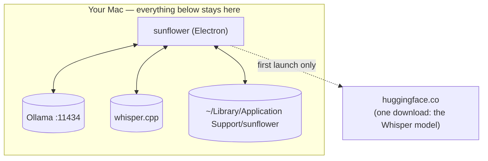

- **No telemetry, no analytics, no network** except the local Ollama host — and
  a single Whisper model download on first launch. (The *Swift prototype* is
  different: it inherited PostHog analytics, now opt-in and off by default, and
  a hard no-op unless a `POSTHOG_API_KEY` is present.)
- **Sunflower's own windows are excluded from its screenshots**
  (`setContentProtection(true)`), so a run never comments on its own interface.
- **Screenshots are never written to disk** — they exist as base64 in memory for
  the duration of one request.
- **Mood detection writes nothing and sends nothing**; the classified family
  never reaches the model.
- **Renderers are sandboxed at the API level**: `contextIsolation: true`,
  `nodeIntegration: false`, and the entire surface is the explicit
  `SunflowerBridge`.
- **File contents never cross IPC** from Sunflower-Code — only bounded diffs.
- **Independent write gates**: shell commands must survive the blacklist, and
  Sunflower-Code's write/execute tools are gated by the permission level.
- **Secrets are refused by path**: `.env*`, `.npmrc`, `.netrc`, `id_rsa`,
  `id_ed25519`, `.dev.vars` are rejected before being opened.
- **Sunflower Work touches nothing while you are at the keyboard**, refuses to
  start without the Accessibility grant, refuses to click when the screenshot
  cannot be matched to the current display, and never opens apps it cannot see,
  touches system settings, or types passwords (prompt-level constraints).
- **The Claude Code bridge adds no network of any kind.** It is off by default,
  read-only with respect to Claude — Sunflower never sends a prompt, a file or
  a token anywhere near it — and the one file it writes outside its own
  directories is `~/.claude/settings.json`, only on an explicit gesture, backed
  up once beforehand, and restored byte-for-byte on unticking. Hook payloads
  live in `claude/spool/` (mode `0700`) for the milliseconds between the write
  and the read, then are deleted; only a 160-character excerpt is kept, in
  memory. Worth stating plainly: Claude Code already writes its full transcript
  unencrypted to `~/.claude/projects/**.jsonl`, so a momentary copy of one
  message under Sunflower's own data directory discloses nothing new.

---

## The server (Cloudflare Worker)

`apps/server` — a Hono app on Cloudflare Workers, used by the **Swift
prototype only**. The Electron app never touches it.

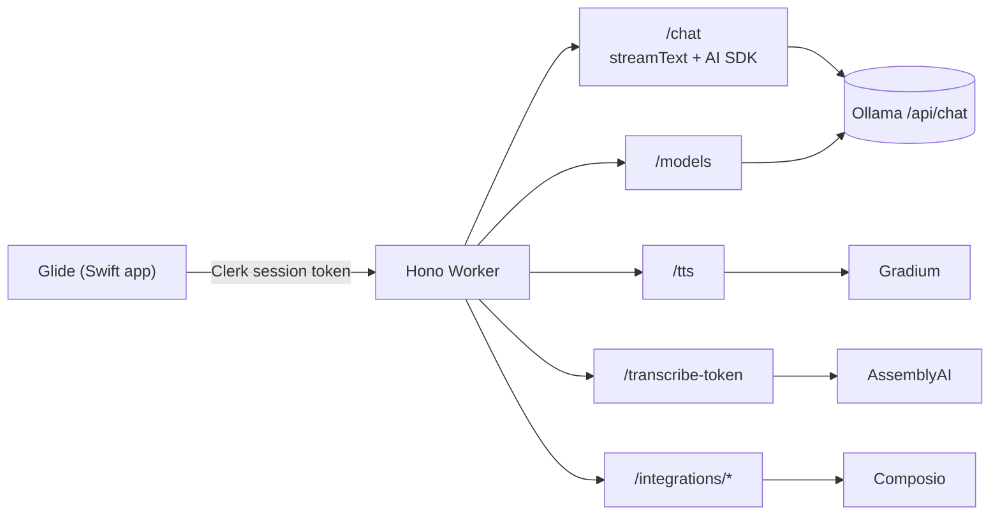

| Method | Route | Purpose |
| --- | --- | --- |
| `POST` | `/chat` | streaming chat; optional `model` overrides `OLLAMA_MODEL` for that request |
| `GET` | `/models` | models pulled locally, with capabilities and the configured default |
| `POST` | `/tts` | Gradium text-to-speech proxy |
| `POST` | `/transcribe-token` | short-lived AssemblyAI streaming token |
| `POST` | `/integrations/statuses` | which toolkits are connected |
| `POST` | `/integrations/:toolkit/connect` | create a Composio connection link |
| `DELETE` | `/integrations/:toolkit/disconnect` | remove connected accounts |

All routes sit behind `clerkMiddleware()` + `requireAuth`.

### The `/chat` error contract

`/chat` streams (AI SDK UI Message Stream protocol, SSE on a 200), so most
failures cannot use an HTTP status. There are exactly two failure shapes:

1. **Pre-stream** — a normal non-200 JSON body `{ "error": string }`. Covers a
   malformed body (400) and, via `preflightOllama()`, an unreachable host (503)
   or a model never pulled (404).
2. **In-stream** — a chunk `{ "type": "error", "errorText": string }` written
   into the already-200 stream, then the stream ends. Covers Ollama going away
   mid-answer, the model being unloaded concurrently, or a client abort.
   `errorText` forwards Ollama's own message where there is one.

Both are logged server-side before the text is derived.

### Ollama tuning on the server side

| Var | Default | Notes |
| --- | --- | --- |
| `OLLAMA_HOST` | `http://localhost:11434` | plain var in `wrangler.toml` |
| `OLLAMA_MODEL` | `qwen3-vl:8b` | |
| `OLLAMA_NUM_CTX` | `32768` | Ollama's 4096 default truncates a screenshot silently. Lower to `16384` on limited RAM. |

`num_predict` is set explicitly because Ollama's native `/api/chat` ignores the
AI SDK's `max_output_tokens`. With app tools loaded, `stopWhen` allows 40 steps
instead of 20 and output is floored at 4096 tokens.

### Composio integrations

`@composio/core` with the Composio Vercel provider. Tools are loaded **only
when the request actually calls for external-app work**
(`shouldUseAppIntegrationTools()`), scoped to the signed-in user's connected
accounts. OAuth returns to the app via `glide://composio/callback`.

This path needs a model with the `tools` capability. With a vision-only model,
chat and screen understanding work fine and integrations are simply ignored.

### Deployment

Sunflower is built around a local Ollama, and `localhost` means something
different inside a deployed Worker.

- **Recommended:** run the Worker locally (`pnpm run dev:server`, port 8787) on
  the same machine as Ollama.
- **Otherwise:** point `OLLAMA_HOST` at an instance the Worker can reach, and
  **put authentication in front of Ollama** — its API has none of its own.
  Never expose port `11434` to the internet. Note that a plain var with the
  same name overrides a secret on every deploy, so delete the `[vars]` line if
  you store the host as a secret.

---

## The Swift prototype (`apps/macos`)

Kept for reference; **not what runs**. The Xcode project, scheme and target are
still named `Glide`, and the URL scheme is still `glide://` — renaming is
cosmetic and would risk breaking the Clerk and Composio redirect flows.

Notable files:

| File | Role |
| --- | --- |
| `GlideApp.swift`, `AppBundleConfiguration.swift` | app entry, Info.plist-injected config |
| `GlobalPushToTalkShortcutMonitor.swift` | push-to-talk |
| `CompanionScreenCaptureUtility.swift` | screen capture |
| `AISDK.swift` | Worker `/chat` client, including the in-stream `error` chunk |
| `AssemblyAIStreamingTranscriptionProvider.swift`, `AppleSpeechTranscriptionProvider.swift`, `BuddyTranscriptionProvider.swift` | transcription backends |
| `GradiumTTSClient.swift` | speech |
| `CompanionManager.swift`, `CompanionPanelView.swift`, `CompanionResponseOverlay.swift` | the companion |
| `GlideDynamicIslandManager.swift`, `MenuBarPanelManager.swift` | status surfaces |
| `GlideAuthManager.swift` | Clerk |
| `GlideAnalytics.swift` | **opt-in** PostHog, hard no-op without a key |

Build config comes from a **gitignored** `apps/macos/Config.xcconfig` (copy
`Config.xcconfig.example`): `CLERK_PUBLISHABLE_KEY`, `DEVELOPMENT_TEAM`,
optional `POSTHOG_API_KEY` and `GLIDE_SERVER_BASE_URL`. Without that file the
build fails immediately rather than silently signing with someone else's
credentials.

---

## Build system

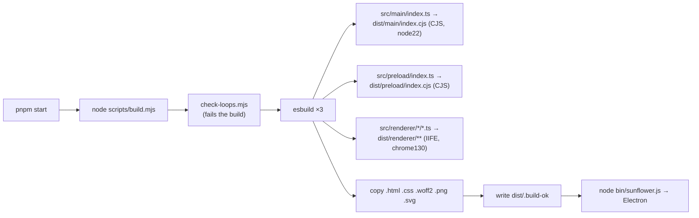

- Externals for the main bundle: `electron`, `uiohook-napi`, `smart-whisper`
  (native modules must not be bundled).
- Nine renderer entry points: island, capture-worklet, companion, panel,
  pointer, onboarding, orb, work, code.
- `pnpm dev` (`build.mjs --watch`) rebuilds and relaunches Electron on change,
  waits for the old instance to exit (the single-instance lock is only released
  on real exit), and watches static assets separately since they are not in the
  esbuild graph. In watch mode the loop check **warns instead of blocking**.
- `dist/` is wiped at the start of every build.

### Scripts

| Command | What it does |
| --- | --- |
| `pnpm install` | once, at the repo root — builds whisper.cpp, needs Xcode CLT |
| `pnpm start` | build + launch the Electron app |
| `pnpm dev` | turborepo dev across apps |
| `pnpm check-types` | `tsc --noEmit` **+ `check-loops.mjs`** |
| `pnpm run dev:server` | the Worker on `localhost:8787` |
| `pnpm run deploy:server` | deploy the Worker |

There is **no test runner and no CI**: the build is the only gate that always
runs. That is precisely why the always-on budget is enforced there.

### Conventions

- Comments in `src/` are in **French**; anything the user reads is in
  **English**.
- Decorative code never throws and never prints to the terminal.
- `shared/` modules import neither `electron` nor `node` — they are pure and
  testable as-is.
- Workspace: pnpm 11 + turborepo, TypeScript 6 from `packages/config`.

---

## Environment variables

| Variable | Scope | Effect |
| --- | --- | --- |
| `OLLAMA_HOST` | Electron, CLIs | overrides `config.ollamaHost` |
| `SUNFLOWER_DEBUG=1` | Electron | full error details, raw unfiltered native logs, pointer diagnostics, watchdog start line |
| `SUNFLOWER_NO_DOUBLE_CHECK=1` | Electron | skip pointing refinement entirely (DOM snap + second vision pass) |
| `SUNFLOWER_FAKE_ANSWER=…` | Electron | replay that text as if streamed — end-to-end parser/guide tests without Ollama (also disables the second vision pass; DOM framing stays active) |
| `NO_COLOR` | Electron TUI | degrade to plain log lines |
| `ELEVENLABS_API_KEY`, `ANTHROPIC_API_KEY`, `WISPR_FLOW_API_KEY` | `requirements` | optional entries, never fail the check when unset |
| `CLERK_SECRET_KEY`, `CLERK_PUBLISHABLE_KEY` | Worker | **required** — every route is authenticated |
| `ASSEMBLYAI_API_KEY`, `GRADIUM_API_KEY`, `COMPOSIO_API_KEY` | Worker | per feature |
| `GRADIUM_TTS_MODEL`, `GRADIUM_TTS_VOICE_ID` | Worker | TTS tuning, defaults in `wrangler.toml` |
| `OLLAMA_MODEL`, `OLLAMA_NUM_CTX` | Worker | see above |

---

## File reference

### `apps/electron/src/main`

| File | Responsibility |
| --- | --- |
| `index.ts` | wiring: IPC handlers, windows, tray, hotkey, lifecycle, `routeToCode()`, `shutdownEverything()` |
| `state-machine.ts` | the voice/typed session orchestrator |
| `ollama.ts` | `/api/tags`, `/api/ps`, streamed `/api/chat`, warm-up, context budget, `<think>` stripping |
| `stt.ts` | whisper.cpp: model download, load, resample, transcribe |
| `screenshot.ts` | `captureScreenAtCursor()` |
| `guide-parser.ts` | streaming marker extraction + coordinate normalisation |
| `guide-runner.ts` | deterministic guide execution |
| `point-verifier.ts` | DOM-first, vision-second pointing refinement |
| `dom-locator.ts` | JXA page-JS injection → interactive elements in screen points |
| `activity.ts` | event-driven frontmost app / tab URL detection |
| `presence.ts` | real-vs-synthetic input tracking |
| `hotkey.ts` | uiohook: `⌃⌥`, global clicks, backoff retry |
| `permissions.ts` | macOS permission status and requests |
| `config-store.ts` | atomic JSON config |
| `shell-guard.ts` | shared destructive-command blacklist |
| `watchdog.ts` | CPU/RSS JSONL sampler |
| `tray.ts`, `pixel-png.ts` | menu-bar icon (pixel art → PNG, 1× and 2×) |
| `tui.ts`, `tui-pixel.ts`, `tui-ansi.ts` | terminal UI |
| `claude/index.ts`, `claude/hooks.ts`, `claude/spool.ts`, `claude/store.ts` | the Claude Code bridge |
| `code/session.ts`, `code/tools.ts`, `code/transcript.ts` | Sunflower-Code |
| `work/runner.ts`, `work/store.ts`, `work/clicker.ts` | Sunflower Work |
| `windows/*.ts` | one module per surface + `common.ts` overlay factory |

### `apps/electron/src/shared`

Pure modules, no `electron`, no `node` — shared main ↔ renderer:

`state.ts` (phases, poses, permissions, `PanelData`) · `ipc.ts` (`CH` +
`SunflowerBridge`) · `config-schema.ts` · `code.ts` (modes, tools, gates,
bounds, transcript types) · `work.ts` (statuses, actions, settings + clamping) ·
`claude.ts` (Claude Code task states, hook events, payload parsing) ·
`orb.ts` (what the right-edge badge shows) · `activity.ts` (families,
classification) · `diff.ts` (bounded LCS) · `sunflower-pixels.ts` (all pixel
art: poses, moods, brackets, menu-bar icon, bee, field).

### `apps/electron/src/renderer`

`island/` (status + mic capture + `capture-worklet.ts`) · `companion/`
(flower, bubble, `tts.ts`) · `panel/` · `pointer/` · `onboarding/` ·
`orb/` · `work/` · `code/` · `shared/` (design tokens: colors, spacing,
typography, effects, fonts + Newsreader woff2, `base.css`, `dev-stub.ts`).

---

## Troubleshooting

**Answers ignore what's on screen.** The model probably has no `vision`
capability — check `ollama show <model>`. If it does, the context may be too
small for the screenshot.

**Integrations never fire.** The model has no `tools` capability (Worker path
only).

**First reply is very slow.** Ollama loads the model on first use. Sunflower
preloads it at launch and when you start speaking, shows `waking the model…`,
and waits up to ~3 minutes for a cold first token (45 s once warm). If it still
times out, warm it manually with `ollama run <model>` or switch to a smaller
vision model such as `minicpm-v`.

**Empty answers / mid-stream failures.** The Electron app watches for an
`error` field in Ollama's NDJSON stream and surfaces a red `[!!]` banner on the
island plus an `[sunflower] error: …` terminal line. The Worker path uses the
two-shape error contract described above. Either way: confirm Ollama is up
(`curl http://localhost:11434/api/tags`) and that the model is actually pulled
— Ollama does not pull on demand.

**Screen recording won't stick.** Its Settings pane only lists an app after a
capture attempt, and there is no "+" button. Click "grant" once (Sunflower
attempts a capture so macOS registers it), then again to open the populated
pane. In dev the entry is named **Electron**. When macOS offers to "Quit &
Reopen", choose **Later** and rerun `npm start` yourself — the auto-relaunch
starts a bare Electron without Sunflower's app path. The grant survives.

**Push-to-talk does nothing.** Accessibility is not granted. `hotkey.ts` retries
with backoff (3 s, doubling to 60 s) and arms the moment you grant it — no
restart needed.

**Sunflower Work refuses to start.** It is macOS-only, opt-in
(`sunflowerWorkEnabled`), and requires the Accessibility grant for the presence
guard. It also refuses when the screenshot cannot be matched to the current
display (multi-monitor).

**The build fails on a loop budget error.** You added a recurring cost. Either
replace it with an event source (see the table above), or declare it in
`apps/electron/scripts/loop-budget.json` — and if it is on by default and
probes the environment, raise the ceiling in the same commit.

**Everything returns 401** (Worker path). The Clerk keys in `.dev.vars` and in
the Xcode build settings must come from the same Clerk application.

---

## License

MIT — see [LICENSE](LICENSE).
