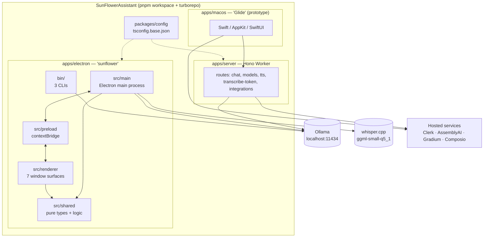
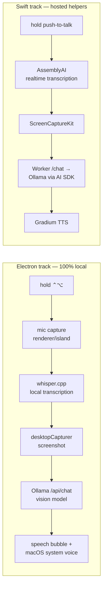
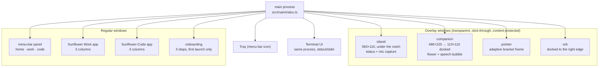
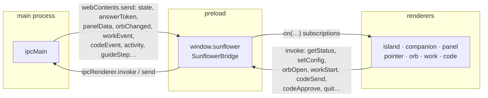

# Architecture

> **Navigation:** [internals hub](README.md) · [brain.yaml](brain.yaml) · related: [internals: file-reference](file-reference.md), [internals: build-system](build-system.md)

### Repository map

```txt
apps/
  electron/   Electron screen companion "sunflower" — fully local
    bin/      sunflower, sunflower-models, sunflower-requirements CLIs
    scripts/  esbuild build, always-on budget check, native-log filter
    src/
      main/       Electron main process (Node)
      preload/    contextBridge → window.sunflower
      renderer/   one bundle per window surface (IIFE)
      shared/     types + pure logic, no electron / no node
  macos/      Native Swift/AppKit menu-bar app (earlier prototype)
  server/     Hono Cloudflare Worker API (used by the Swift app)
packages/
  config/     Shared TypeScript config (@piksy/config)
```



### Two implementations, one idea



The Electron app needs **no server, no Clerk, no API keys**. The Swift app
needs a running Worker and a Clerk application; every one of its routes is
authenticated.

### Electron process topology

Seven renderer surfaces, all created by the main process. Overlays are
transparent, click-through, always-on-top and **excluded from Sunflower's own
screenshots** via `setContentProtection(true)` (`main/windows/common.ts`).



| Surface | Window type | Visibility rule |
| --- | --- | --- |
| `island` | overlay, 560×110, centred under the notch | hidden at `idle`, shown on any other state, 2 s grace before hiding |
| `companion` | overlay, 480×220 (110×110 docked) | always visible after onboarding; click-through except over the flower |
| `pointer` | overlay, resizable | 4 s per frame (`POINTER_MS`), or sticky during a guide |
| `orb` | overlay, focusable | only while a code session or work run is busy |
| `panel` | popover anchored to the tray | toggled by the tray click; self-sizes to its card height |
| `work` / `code` | regular windows | opened on demand; closing hides, state survives |
| `onboarding` | regular window | first launch only (`onboarded: false`) |

### The IPC contract

Every channel name lives in `shared/ipc.ts` under the `CH` constant, and the
whole renderer-visible surface is the `SunflowerBridge` interface exposed by
`preload/index.ts` as `window.sunflower`. Renderers have
`contextIsolation: true`, `nodeIntegration: false` — no direct Node access.



Channel families:

| Prefix | Direction | Purpose |
| --- | --- | --- |
| `sf:state`, `sf:answer-*`, `sf:point-show`, `sf:guide-step`, `sf:tts-*` | main → renderer | the live session |
| `sf:mic-*` | both | mic start/stop commands, PCM data back |
| `sf:panel-data`, `sf:activity` | main → renderer | status card, mood snapshot |
| `sf:orb:*` | both | the right-edge orb: status, hover, drag, click |
| `sf:work:*` | both | Sunflower Work sessions |
| `sf:code:*` | both | Sunflower-Code (single shared session — **no session id in any method**) |
| `sf:permissions:*`, `sf:config:*`, `sf:whisper:*`, `sf:app:quit` | renderer → main | setup and lifecycle |
