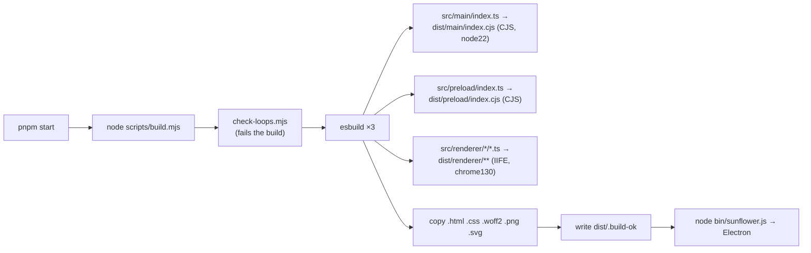

# Build system

> **Navigation:** [internals hub](README.md) · [brain.yaml](brain.yaml) · related: [internals: effort-and-budget](effort-and-budget.md), [internals: architecture](architecture.md)

- Externals for the main bundle: `electron`, `uiohook-napi`, `smart-whisper`
  (native modules must not be bundled).
- Nine renderer entry points: island, capture-worklet, companion, panel,
  pointer, onboarding, orb, work, code.
- `pnpm dev` (`build.mjs --watch`) rebuilds and relaunches Electron on change,
  waits for the old instance to exit (the single-instance lock is only released
  on real exit), and watches static assets separately since they are not in the
  esbuild graph. In watch mode the loop check **warns instead of blocking**.
- `dist/` is wiped at the start of every build.

### Scripts

| Command | What it does |
| --- | --- |
| `pnpm install` | once, at the repo root — builds whisper.cpp, needs Xcode CLT |
| `pnpm start` | build + launch the Electron app |
| `pnpm dev` | turborepo dev across apps |
| `pnpm check-types` | `tsc --noEmit` **+ `check-loops.mjs`** |
| `pnpm run dev:server` | the Worker on `localhost:8787` |
| `pnpm run deploy:server` | deploy the Worker |

There is **no test runner and no CI**: the build is the only gate that always
runs. That is precisely why the always-on budget is enforced there.

### Conventions

- Comments in `src/` are in **French**; anything the user reads is in
  **English**.
- Decorative code never throws and never prints to the terminal.
- `shared/` modules import neither `electron` nor `node` — they are pure and
  testable as-is.
- Workspace: pnpm 11 + turborepo, TypeScript 6 from `packages/config`.
