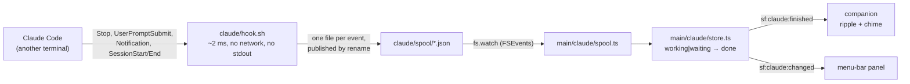

# The Claude Code bridge

> **Navigation:** [internals hub](README.md) · [brain.yaml](brain.yaml) · related: [guide: companion-features](../guide/companion-features.md)

You launch a long task in Claude Code, switch to something else, and then keep
going back to the terminal to see whether it is done. The flower is already on
the desktop; it can just tell you.

When the bridge is on, Sunflower follows the Claude Code sessions running on the
same Mac and, **the moment one of them finishes, the flower emits three orange
rings and a two-note chime**. That is the whole notification: no speech bubble,
no Notification Center, no orb badge.

The colour is not a coincidence — `--orange` (`#D97757`) has been described in
`renderer/shared/tokens/colors.css` as *"the Claude clay-orange accent"* since
long before this feature existed.

### Where the signal comes from

Claude Code can run a command on its own lifecycle events. Sunflower registers
a short `/bin/sh` script for five of them; the script drops the event's JSON
payload into a spool directory, and `fs.watch` wakes the app.



**Nothing polls.** This is the fifth "watch the environment continuously"
temptation in this repository and the first one that never had to be talked out
of it: the events are pushed by Claude itself. When Claude is not running,
**not one line of this module executes** — which is why the feature adds
**zero entries** to `scripts/loop-budget.json` and leaves both ceilings at
`2` and `1`.

The alternative — tailing `~/.claude/projects/**/*.jsonl` and guessing what
"finished" means from the last entry — was rejected: it needs a quiet-window
timer, and it is a guess where the hook is a fact.

### The five events, and the two that were refused

| Event | Matcher | Why |
| --- | --- | --- |
| `Stop` | — | **This is "Claude finished".** One per assistant turn. |
| `UserPromptSubmit` | — | Puts the task back to `working`, so the *next* `Stop` is a real edge. Without it, turn 2 of a session would never ripple. |
| `SessionStart` | `startup\|resume\|clear` | Creates the task with its folder. `compact` is excluded — it fires over and over during a long task. |
| `Notification` | `permission_prompt\|agent_needs_input` | The `waiting` state. `idle_prompt` is excluded: it arrives *after* a `Stop` already handled. |
| `SessionEnd` | — | Removes the task instead of leaving a ghost in the panel. |

**`SubagentStop` is deliberately not registered.** One turn can spawn a dozen
subagents finishing seconds apart — a process each, a ripple storm, and worst
of all a *lie*, since they finish while Claude is still working.

Steady-state cost per Claude turn: **two short `sh` processes**, in Claude's
process tree, only while Claude runs.

### What it writes, and how to undo it

Enabling adds one group per event to `~/.claude/settings.json`. That file
belongs to the user, so the module is the most defensive in the repository:

- an entry is Sunflower's **iff** its command contains `sunflower/claude/hook.sh`
  — no field is added to Claude's schema, no foreign group is ever merged into
  or reordered;
- **invalid JSON means no write at all.** People put comments in that file;
  refusing is the only safe answer;
- symlinks are resolved first, so a `~/.claude/settings.json` pointing into a
  dotfiles repo is never replaced by a regular file;
- the file is copied once to `claude/settings-backup.json` before the first
  write, and its size + mtime are re-checked immediately before the rename, so
  a concurrent write by Claude Code is refused rather than clobbered;
- **it only ever writes on an explicit gesture** — the tray checkbox, `/claude
  on|off`, or the panel. Never at startup, never at quit, never as a silent
  repair.

The installed command is guarded:

```sh
[ -x '…/sunflower/claude/hook.sh' ] && '…/sunflower/claude/hook.sh' || true
```

so if Sunflower's data directory is ever deleted while the block survives, the
hook is a silent no-op instead of printing a failure inside every Claude turn.

Four ways to switch it off, all equivalent:

1. untick the tray item — removes the block, the script and the spool;
2. `/claude off` in the terminal;
3. edit `~/.claude/settings.json` by hand, or set `"disableAllHooks": true`;
4. `rm -rf "~/Library/Application Support/sunflower/claude"` — the `[ -x ]`
   guard makes the leftover block harmless.

**Claude Code reads its hooks when a session starts**, so a session that was
already open will not ripple. Enabling says so rather than looking broken.

### Reading the state

`/claude` prints whether the bridge is on, what the hooks actually look like,
and the sessions seen so far. The setting is the record of *intent* and
`status()` is the ground truth; when they disagree — hooks edited by hand, data
directory wiped — the gap is **shown**, never silently repaired.

| State | Meaning |
| --- | --- |
| `no-claude` | no `~/.claude`: Claude Code isn't installed |
| `absent` | nothing of ours in the settings |
| `installed` | all five events registered |
| `partial` | some only — hand-edited; tick again to repair |
| `stale` | our entries are there, our script is gone |
| `disabled` | `"disableAllHooks": true` |
| `unreadable` | invalid JSON or no permission — left untouched |

### Why this isn't a third task system

Commit `6928ca9` deleted the "agents" feature because *"keeping all three meant
three answers to the same question"*. That question was **"how does Sunflower
run a task for you"** — and this module does not answer it. Sunflower never
sends anything to Claude; the bridge is read-only, and the right comparison is
`activity.ts`, a sensor, not `work/runner.ts`, a runner.

`WorkSession` cannot be reused without becoming a lie: its documented contract
is *sole writer* (a Claude session is written by a process Sunflower cannot
see), its API is all steering — `workCancel`, `workChat`, `openTerminal` — and
its `queued()` list feeds the Work runner's `pump()`, so a Claude session
parked there would be **picked up and executed by Sunflower Work**.

`OrbSource` is untouched, and stays `"code" | "work"`. `shared/orb.ts` was
deliberately built source-agnostic, so a third member is cheap the day someone
wants Claude runs on the right-edge badge. This version doesn't spend it: the
ripple is the notification.
