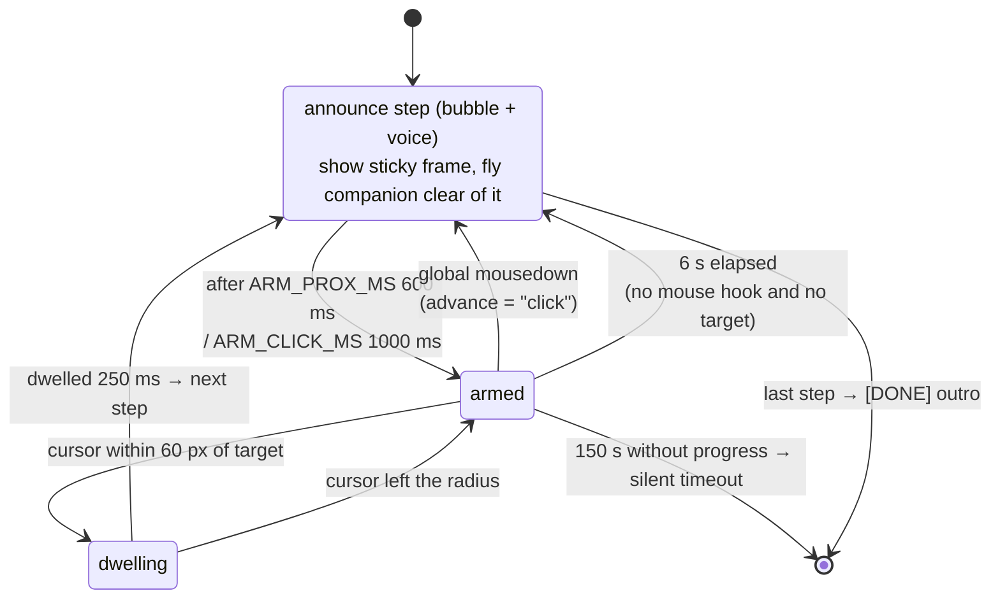

# Guide mode

> **Navigation:** [internals hub](README.md) · [brain.yaml](brain.yaml) · related: [internals: pointing](pointing.md), [internals: voice-pipeline](voice-pipeline.md)

`main/guide-runner.ts` executes a plan **deterministically — no AI call between
steps**. Progression comes from geometry (cursor near the target) or a global
click; everything else is timing.

| Constant | Value | Role |
| --- | --- | --- |
| `PROX_RADIUS_PX` | 60 | absorbs the vision model's ±1–2 % imprecision |
| `DWELL_MS` | 250 | continuous stay before advancing |
| `ARM_PROX_MS` / `ARM_CLICK_MS` | 600 / 1000 | ignore proximity/clicks right after announcing |
| `PREV_TARGET_GRACE_MS` | 2500 | a click near the *previous* target finishes that action |
| `POLL_MS` | 50 | proximity poll — bounded to an active guide |
| `GUIDE_IDLE_MS` | 150 000 | guide dies quietly |
| `NO_HOOK_ADVANCE_MS` | 6000 | timed advance when Accessibility is unavailable |

When a step carries a box, the frame wraps the whole element and the companion
parks clear of it (`flyTo({clearance})`, `FLY_CLEARANCE_MARGIN = 24`).
A question typed during a guide cancels it and starts a normal turn.
