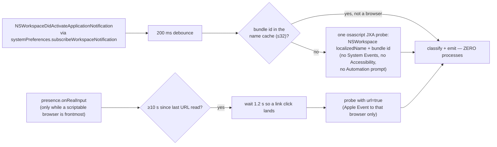

# Moods — contextual activity detection

> **Navigation:** [internals hub](README.md) · [brain.yaml](brain.yaml) · related: [internals: effort-and-budget](effort-and-budget.md), [guide: companion-features](../guide/companion-features.md)

When the flower has nothing else to do, it gives itself an accessory matching
whatever app is in front of you.

| Family | Trigger examples | Prop |
| --- | --- | --- |
| `music` | Deezer, Spotify, Apple Music, Tidal · `spotify.com`, `deezer.com` | headphones |
| `coding` | Cursor, VS Code, Xcode, terminals, JetBrains · `github.com`, `stackoverflow.com` | little laptop |
| `ai` | Claude, ChatGPT, Gemini, Ollama, LM Studio · `claude.ai`, `chatgpt.com` | "AI" placard |
| `streaming` | Netflix, YouTube, Twitch, IINA · `youtube.com`, `netflix.com` | popcorn |
| `creative` | Figma, Premiere Pro, Photoshop, Blender, Logic · `figma.com` | plaid blanket, hunched over |
| `messaging` | Snapchat, Discord, Slack, Messages, Teams · `discord.com` | phone with messages flying |
| `doomscroll` | TikTok, Instagram, Threads, X, Reddit · `tiktok.com` | phone, wilted petals, slow "zzz" |
| `none` | anything unrecognised | no prop rather than a wrong one |

Classification (`shared/activity.ts`, dependency-free and testable) is exact
name match first, then a length-≥5 substring fallback (`Visual Studio Code -
Insiders` stays coding). **For a browser the site decides, not the app** —
Chrome on `netflix.com` is streaming.

**Nothing polls.** This is the fourth "watch the environment continuously"
feature in this repository and the fourth one that made a Mac hot; the first
version forked an `osascript` every 4 seconds (~900 processes an hour, each
enumerating every app over Apple Events, on by default). What replaced it:

Guarantees: only a **family change** emits (tab-hopping on YouTube doesn't
re-flash the popcorn); a failed probe **keeps the previous prop** rather than
flickering; 5 consecutive failures give up for the session
(`MAX_HARD_FAILURES`); Automation refusals are remembered per bundle
(`urlDenied`) and never re-asked; the watcher stops entirely when the companion
is hidden or `moodsEnabled` is unticked. Nothing is written to disk, nothing is
sent to the model, nothing leaves the Mac.

A mood **only ever shows at idle**: the moment a question, guide, code session
or work run has something to say, the real pose wins.
