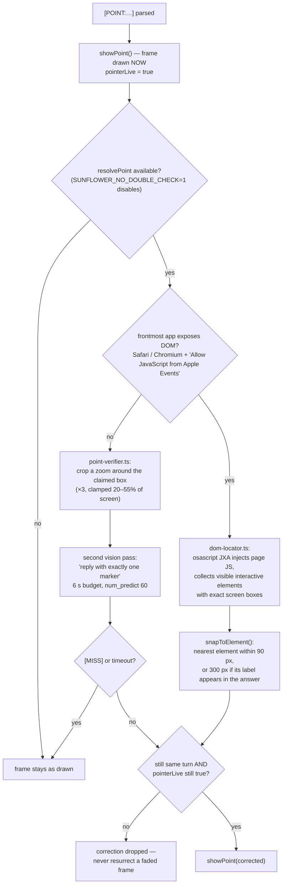

# Pointing

> **Navigation:** [internals hub](README.md) · [brain.yaml](brain.yaml) · related: [internals: guide-mode](guide-mode.md), [guide: pointing](../guide/pointing.md)

The frame draws **immediately** from the model's own box — pointing never waits
on a round-trip. A **double check** then refines it *in place*, treating the
first marker as a claim to improve rather than a gate.

**Frame geometry** (`main/windows/pointer.ts`): constant-thickness pixel-art
brackets, 10 px padding (`FRAME_PAD_PX`), clamped between 60×48 px and 70 % of
the screen (`FRAME_MAX_FRAC`), always fully on screen. The window itself is
15 % larger than the frame so the scale-in animation is not clipped.

**Guide steps are different**: their targets are DOM-snapped from a *single*
snapshot **before** the step is drawn — visible-target steps only — so guide
execution stays deterministic with no extra model calls between steps.

Every fallback is silent and non-blocking. `SUNFLOWER_DEBUG=1` logs each
marker's raw text, the detected convention and the final frame rectangle.
