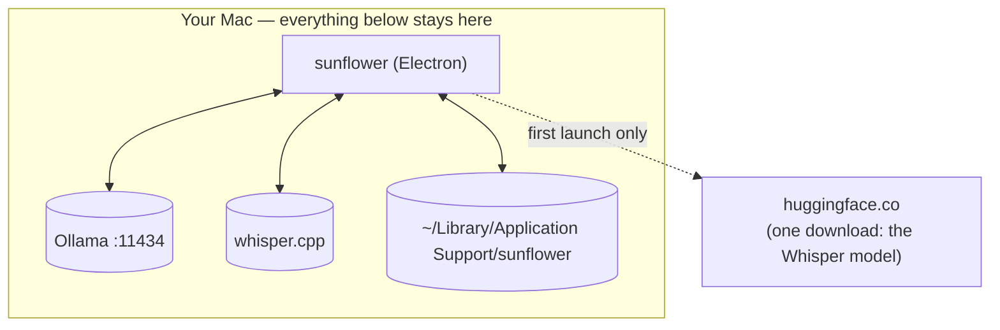

# Security and privacy model

> **Navigation:** [internals hub](README.md) · [brain.yaml](brain.yaml) · related: [internals: sunflower-code](sunflower-code.md), [internals: moods](moods.md)

- **No telemetry, no analytics, no network** except the local Ollama host — and
  a single Whisper model download on first launch. (The *Swift prototype* is
  different: it inherited PostHog analytics, now opt-in and off by default, and
  a hard no-op unless a `POSTHOG_API_KEY` is present.)
- **Sunflower's own windows are excluded from its screenshots**
  (`setContentProtection(true)`), so a run never comments on its own interface.
- **Screenshots are never written to disk** — they exist as base64 in memory for
  the duration of one request.
- **Mood detection writes nothing and sends nothing**; the classified family
  never reaches the model.
- **Renderers are sandboxed at the API level**: `contextIsolation: true`,
  `nodeIntegration: false`, and the entire surface is the explicit
  `SunflowerBridge`.
- **File contents never cross IPC** from Sunflower-Code — only bounded diffs.
- **Independent write gates**: shell commands must survive the blacklist, and
  Sunflower-Code's write/execute tools are gated by the permission level.
- **Secrets are refused by path**: `.env*`, `.npmrc`, `.netrc`, `id_rsa`,
  `id_ed25519`, `.dev.vars` are rejected before being opened.
- **Sunflower Work touches nothing while you are at the keyboard**, refuses to
  start without the Accessibility grant, refuses to click when the screenshot
  cannot be matched to the current display, and never opens apps it cannot see,
  touches system settings, or types passwords (prompt-level constraints).
- **The Claude Code bridge adds no network of any kind.** It is off by default,
  read-only with respect to Claude — Sunflower never sends a prompt, a file or
  a token anywhere near it — and the one file it writes outside its own
  directories is `~/.claude/settings.json`, only on an explicit gesture, backed
  up once beforehand, and restored byte-for-byte on unticking. Hook payloads
  live in `claude/spool/` (mode `0700`) for the milliseconds between the write
  and the read, then are deleted; only a 160-character excerpt is kept, in
  memory. Worth stating plainly: Claude Code already writes its full transcript
  unencrypted to `~/.claude/projects/**.jsonl`, so a momentary copy of one
  message under Sunflower's own data directory discloses nothing new.
