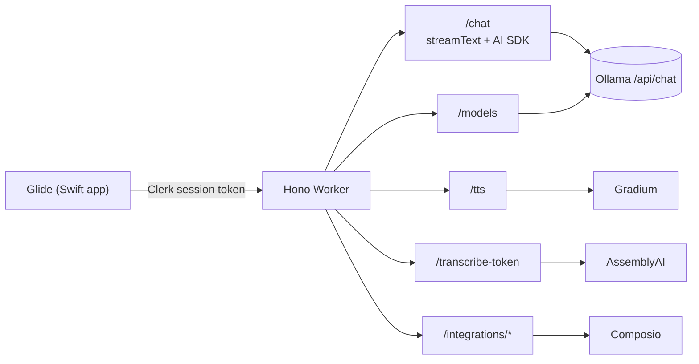

# The server (Cloudflare Worker)

> **Navigation:** [internals hub](README.md) · [brain.yaml](brain.yaml) · related: [guide: api](../guide/api.md), [guide: deployment](../guide/deployment.md)

`apps/server` — a Hono app on Cloudflare Workers, used by the **Swift
prototype only**. The Electron app never touches it.

| Method | Route | Purpose |
| --- | --- | --- |
| `POST` | `/chat` | streaming chat; optional `model` overrides `OLLAMA_MODEL` for that request |
| `GET` | `/models` | models pulled locally, with capabilities and the configured default |
| `POST` | `/tts` | Gradium text-to-speech proxy |
| `POST` | `/transcribe-token` | short-lived AssemblyAI streaming token |
| `POST` | `/integrations/statuses` | which toolkits are connected |
| `POST` | `/integrations/:toolkit/connect` | create a Composio connection link |
| `DELETE` | `/integrations/:toolkit/disconnect` | remove connected accounts |

All routes sit behind `clerkMiddleware()` + `requireAuth`.

### The `/chat` error contract

`/chat` streams (AI SDK UI Message Stream protocol, SSE on a 200), so most
failures cannot use an HTTP status. There are exactly two failure shapes:

1. **Pre-stream** — a normal non-200 JSON body `{ "error": string }`. Covers a
   malformed body (400) and, via `preflightOllama()`, an unreachable host (503)
   or a model never pulled (404).
2. **In-stream** — a chunk `{ "type": "error", "errorText": string }` written
   into the already-200 stream, then the stream ends. Covers Ollama going away
   mid-answer, the model being unloaded concurrently, or a client abort.
   `errorText` forwards Ollama's own message where there is one.

Both are logged server-side before the text is derived.

### Ollama tuning on the server side

| Var | Default | Notes |
| --- | --- | --- |
| `OLLAMA_HOST` | `http://localhost:11434` | plain var in `wrangler.toml` |
| `OLLAMA_MODEL` | `qwen3-vl:8b` | |
| `OLLAMA_NUM_CTX` | `32768` | Ollama's 4096 default truncates a screenshot silently. Lower to `16384` on limited RAM. |

`num_predict` is set explicitly because Ollama's native `/api/chat` ignores the
AI SDK's `max_output_tokens`. With app tools loaded, `stopWhen` allows 40 steps
instead of 20 and output is floored at 4096 tokens.

### Composio integrations

`@composio/core` with the Composio Vercel provider. Tools are loaded **only
when the request actually calls for external-app work**
(`shouldUseAppIntegrationTools()`), scoped to the signed-in user's connected
accounts. OAuth returns to the app via `glide://composio/callback`.

This path needs a model with the `tools` capability. With a vision-only model,
chat and screen understanding work fine and integrations are simply ignored.

### Deployment

Sunflower is built around a local Ollama, and `localhost` means something
different inside a deployed Worker.

- **Recommended:** run the Worker locally (`pnpm run dev:server`, port 8787) on
  the same machine as Ollama.
- **Otherwise:** point `OLLAMA_HOST` at an instance the Worker can reach, and
  **put authentication in front of Ollama** — its API has none of its own.
  Never expose port `11434` to the internet. Note that a plain var with the
  same name overrides a secret on every deploy, so delete the `[vars]` line if
  you store the host as a secret.
