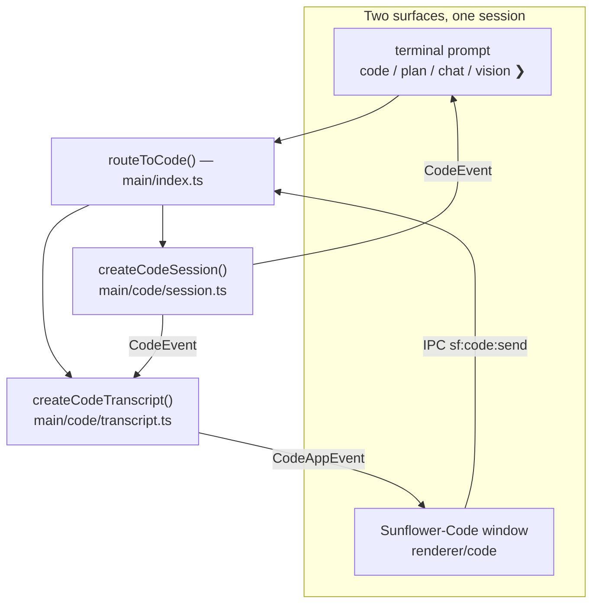
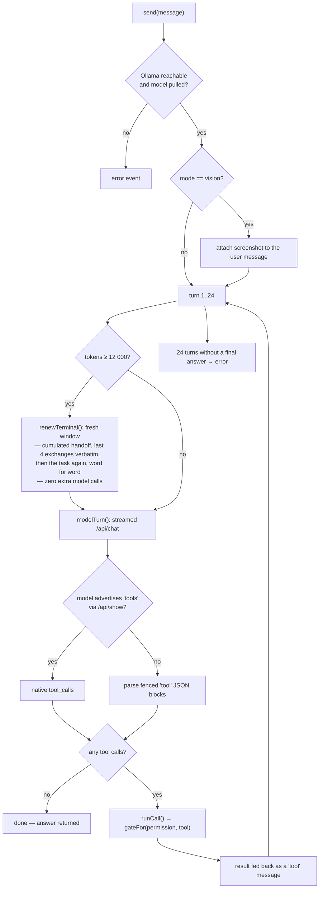

# Sunflower-Code — the coding harness

> **Navigation:** [internals hub](README.md) · [brain.yaml](brain.yaml) · related: [guide: sunflower-code](../guide/sunflower-code.md), [internals: terminal](terminal.md)

A port of [Ollama-Code](https://github.com/Tromset/Ollama-Code)'s
infrastructure living inside Sunflower, running against the same local Ollama.

**There is exactly one entry point** — `routeToCode()` in `main/index.ts` — so
there is exactly one place to look to know where a message went. Both the
terminal (`code ❯` prompt) and the dedicated window go through it, and there is
**one session**, shared: no method in the IPC surface takes a session id.

### The agentic loop

**Two tool dialects, one code path.** `supportsNativeTools(model)` caches the
answer from `POST /api/show`. If the model advertises `tools`, Ollama's native
tool interface is used; otherwise the system prompt describes a text protocol —
one fenced `tool` block holding `{"name": …, "args": {…}}` — and
`parseTextToolCalls()` produces the same `CodeToolCall`. Nothing downstream
knows which one served.

**Modes** (`CodeMode`):

| Mode | Toolbox | Notes |
| --- | --- | --- |
| `code` | all 7 tools | the full workshop |
| `chat` | none | answers from the conversation alone |
| `vision` | all 7 tools | a screenshot is attached to the message |
| `plan` | read-only | investigate, then write out a numbered plan |

**Tools** (`CodeToolName`), all confined to one project folder:

| Tool | Effect | Bounds |
| --- | --- | --- |
| `read_file` | read | 60 000 bytes, optional 1-based `start`/`end` |
| `list_files` | read | 400 entries, depth 0–8 (default 3), skips `node_modules`, `dist`, `.git`… |
| `search` | read | regex, 80 hits, 3000 files scanned, skips files > 1 MB and binaries |
| `write_file` | write | 400 000 bytes max; re-reads the file first so the app can show a real diff |
| `edit_file` | write | exact snippet, must appear **exactly once** |
| `move_file` | write | rename/move inside the folder, refuses to overwrite |
| `bash` | execute | cwd locked to the folder, 180 s timeout, process-group kill, blacklist |

**Path safety** (`resolveInside()`): an absolute path, a `..`, or a basename in
`SECRET_FILES` (`.env`, `.env.local`, `.npmrc`, `.netrc`, `id_rsa`,
`id_ed25519`, `.dev.vars`) is refused *before* anything is opened.

**Permission levels** (`CodePermission`) — the gate matrix from
`shared/code.ts`, which the app's left column renders by calling the very same
`gateFor` / `toolsFor` functions the harness calls:

| Level | read tools | write tools | `bash` |
| --- | --- | --- | --- |
| `plan` | allow | **deny** | **deny** |
| `normal` *(default)* | allow | **ask** | **ask** |
| `yolo` | allow | allow | allow |

The **mode can restrict further but never widen**: `plan` mode is read-only
even under `yolo`, and `chat` exposes no tools at all whatever the level.

**Bounds** (`shared/code.ts` + `main/code/session.ts`):

| Constant | Value |
| --- | --- |
| `CODE_MAX_TURNS` | 24 turns per user request |
| `CODE_COMPACT_AT_TOKENS` | 12 000 → a fresh terminal |
| `MAX_CALLS_PER_TURN` | 4 (extras are refused **loudly**, never silently truncated) |
| `NUM_CTX` / `NUM_PREDICT` | 16 384 / 2048 |
| `FIRST_TOKEN_MS` / `INTER_CHUNK_MS` | 300 s / 90 s |
| `MAX_TOOL_RESULT` / `MAX_TOOL_DISPLAY` | 20 000 / 1200 chars |
| `MAX_TASK_CHARS` / `MAX_HANDOFF_CHARS` | 4 000 / 2 000 chars across a seam |
| `HANDOFF_TAIL_MESSAGES` / `MAX_TAIL_CHARS` | 4 exchanges verbatim, 800 chars each |

**Changing terminal keeps the task.** Like Work, the harness calls a renewed
context window a *terminal*, and `renewTerminal()` (`main/code/session.ts`)
builds the new one out of three pieces, in this order:

1. the **handoff** — the tools run and the last answer *of the window being
   closed*, prefixed with the previous handoff (`(earlier) …`), so terminal 4
   still knows what terminal 1 did, without repeating it;
2. the **last four exchanges verbatim** (truncated, images dropped) — a summary
   says what was done, this carries the exact paths and symbol names;
3. **the task prompt itself, word for word and last** — the user message
   object, so a `vision` screenshot crosses with it.

That third piece is the whole point: the old `compact()` replaced the message
list with a summary quoting `visible.find(role === "user")`, i.e. the *first*
request of the session — so a second task, renewed mid-flight, lost its own
prompt and inherited someone else's. Renewals cost **zero extra model calls**;
they stay instant and deterministic. `CodeSessionInfo.terminal` carries the
1-based number, and both surfaces show the seam (`fresh terminal 2, the task
carries over` in the CLI, `✦ 12.0k tokens — terminal 2, task kept` in the app)
instead of hiding it.

**Approvals** are single-in-flight but **two surfaces can answer**. The waiter
carries the `callId`: the terminal answers without one (it can only reply to
the prompt it just printed), the window answers with it, so a click landing on
an already-settled approval does nothing instead of deciding the next one.

**The window** (`renderer/code/`, `main/windows/code.ts`) has three columns:

- **left — what it may do**: mode and permission pills, the project folder, the
  live gate for all seven tools, plus turn/token meters against the real
  ceilings and the terminal you are in.
- **middle — what it is saying**: streaming answer, inline tool calls
  (`▸ read_file src/x.ts` → `✓ 42 lines · 12 ms`), raw command output, a rule
  where one terminal handed over to the next. A pending approval raises a banner **pinned
  above the composer**, showing an `edit_file` diff *before* you allow it.
- **right — what it changed**: every file written this session, newest first,
  with a real before/after diff. **Only the diff crosses IPC — never file
  contents** (`shared/diff.ts`, bounded LCS, `DIFF_MAX_LINES = 300`).

`main/code/transcript.ts` is the app's memory (the terminal keeps nothing):
600 entries, 20 000 chars of raw output per call, 200 000 chars of in-flight
draft. All in memory — a coding conversation never touches disk.

The window costs nothing at rest: no timer, no poll, no `requestAnimationFrame`
— every pixel moves because an event arrived.
