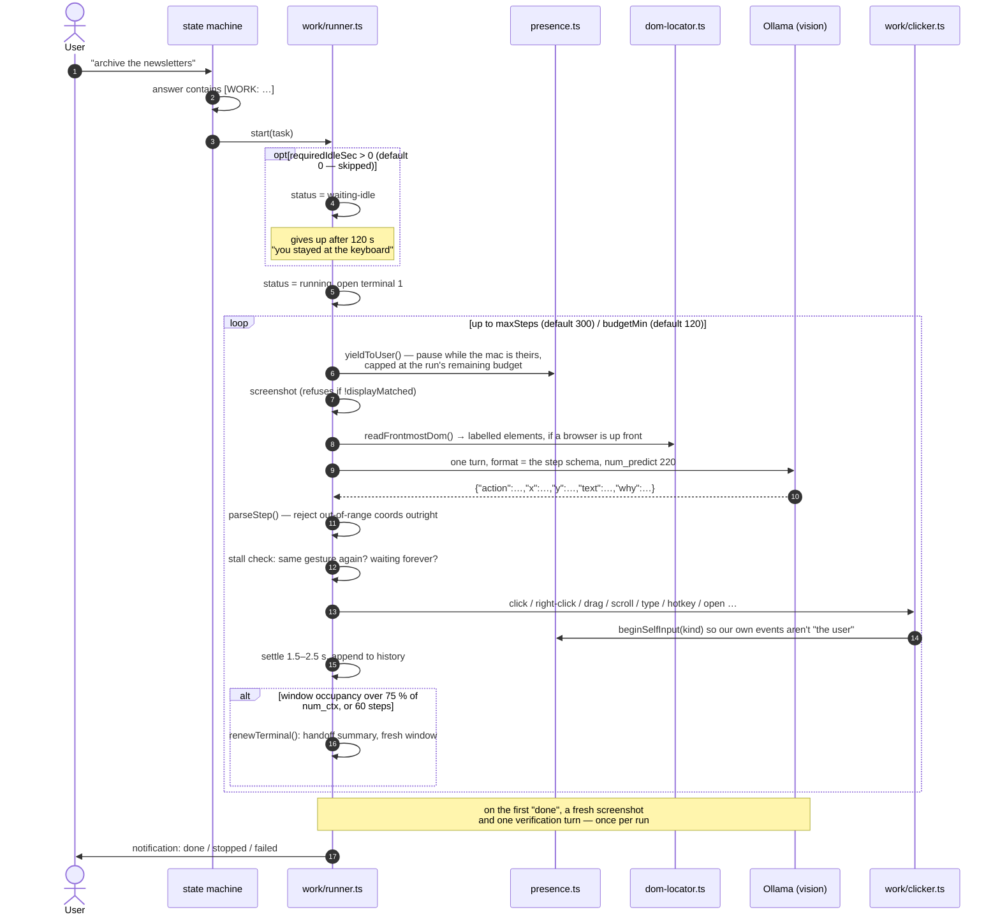

# Sunflower Work — the errand runner

> **Navigation:** [internals hub](README.md) · [brain.yaml](brain.yaml) · related: [guide: sunflower-work](../guide/sunflower-work.md), [internals: orb](orb.md)

Sunflower can drive mouse and keyboard to finish a computer errand — "archive
the newsletters", "close all these tabs". It **starts right away** and hands the
cursor back the moment you touch the machine. It is **off by default**
(`sunflowerWorkEnabled: false`).

**Why it is tenable for hours on a local model — the two mechanisms:**

1. **The terminal renews itself.** A window is renewed when its **occupancy**
   passes 75 % of `num_ctx`, or after `TERMINAL_BUDGET_STEPS = 60`. When one
   fills, the runner writes a handoff summary of the last 8 steps and opens a
   fresh window. The Work app shows the seams (`terminal 2 · 4 800 tokens`)
   instead of hiding them.

   *Occupancy* is the load-bearing word, and it was got wrong for a while.
   Every turn is a **stateless** request that re-sends the system prompt, the
   history and a whole screenshot, so `prompt_eval_count` is the size of the
   *current prompt*, not what the window has gained. Accumulating it charged a
   full image per step: the old fixed 5 000-token ceiling was reached after two
   or three gestures, the terminal renewed itself constantly, and each renewal
   also **unloaded the model** — so the next turn paid a cold reload, often
   longer than its own timeout. One unit bug that looked like three faults: it
   only ever clicked, it stalled for ages, it opened terminals non-stop. The
   runner now compares the current prompt against the real window, and nothing
   is unloaded mid-errand.
2. **The chatbox is not decoration.** Anything you write mid-run is drained by
   `store.drainGuidance()` and handed to the model on its next turn, *above*
   its own plan.

**The action contract.** The model must reply with exactly one JSON object.
`main/work/actions.ts` is the single registry behind it — the accepted names,
the fields each one requires, the grammar lines in the system prompt, the JSON
Schema passed to Ollama in `format`, and the history line all derive from it.
The dispatch is an exhaustive `switch`, so a new action with no branch is a
compile error rather than (as it once was) a silent key press.

| Action | Needs | What it does |
| --- | --- | --- |
| `click` | x, y | one left click |
| `double-click` | x, y | two left clicks |
| `right-click` | x, y | the context menu |
| `type` | x, y, text | click to focus, then type — long text goes via the clipboard and ⌘V |
| `key` | text | one bare key from a 16-name whitelist |
| `hotkey` | text | a combination: `cmd+c`, `cmd+shift+t`, … |
| `scroll` | x, y, text | a real wheel under the cursor; `amount` = wheel clicks |
| `drag` | x, y, x2, y2 | press, move, release |
| `open` | text | an app name or an http(s) URL, through `open-guard.ts` |
| `click-label` | text | click the element with that label, from the DOM reading |
| `wait` | — | nothing, for a moment |
| `done` | — | end the run |

`parseStep()` rejects the reply outright if any coordinate falls outside
`[0,1]` — clamping toward a screen-edge click that has nothing to do with the
target would be worse than retrying. It also validates the three arguments the
model writes out in words (key name, combination, scroll direction), so a
typo costs a replayed turn instead of killing the run. Four consecutive
unusable replies — off-format, or not delivered in time — end it
(`MAX_BAD_REPLIES = 3`).

**Aiming.** `dom-locator.readFrontmostDom()` — already used to snap the voice
assistant's pointer — reads the frontmost browser's interactive elements as
labelled boxes in global points. Work attaches up to 40 of them to each turn,
so the model can name a target with `click-label` instead of guessing
coordinates off a JPEG. Outside a browser the reading returns nothing and the
image is all there is.

**Not getting stuck.** Three guards, all added because "it goes quiet" is
indistinguishable from "it is thinking" from the outside:

- a slow turn **replays** the turn instead of ending the run (a cold model load
  gets `COLD_START_MS = 180 s`, versus `firstTokenMs` for a warm one);
- the same gesture repeated, or `wait` returned over and over, first earns a
  nudge in the next prompt and then stops the run **saying so**;
- the first `done` is checked against a fresh screenshot in one extra turn —
  once per run, so a run can always terminate.

**What `open` will not open.** `work/open-guard.ts` is pure and blunt: http and
https only (`file:`, `javascript:`, `ssh:` and friends are ways of launching
something else), app names matched against `/^[A-Za-z0-9 .+-]{1,40}$/` with no
path, and a blocklist of terminals, system settings, the keychain, script
runners and system utilities — compared on a name flattened to letters and
digits, so `iTerm 2`, `iterm2` and `Terminal.app` are all the same refusal. A
refused target never ends the run: it is recorded as a failed call, told back
to the model, and the next turn tries something else.

**The presence guard.** `main/presence.ts` tracks the last **real** input.
`work/clicker.ts` wraps every synthetic burst in `beginSelfInput(kind)` with a
350 ms grace, **per input family** — a mouse burst must not deafen the keyboard
guard, or a user returning during a multi-second System Events typing burst
would only be noticed afterwards. Typing is split into 40-character chunks so
the guard re-arms roughly every second.

Anything cancels a run instantly: real input, the push-to-talk hotkey, the
panel/tray toggle, `Ctrl+C`, app quit. Work **refuses to start** without the
Accessibility grant (`mouseHookAvailable()`), rather than drive blind, and it
is macOS-only.

**Input synthesis, zero npm dependencies.** `work/clicker.ts` spawns
`/usr/bin/osascript`: JXA + the ObjC bridge posts real CGEvents
(`CGEventCreateMouseEvent`, `CGEventCreateScrollWheelEvent2`, `CGEventPost` on
`kCGHIDEventTap`) in **global points** — the same frame as Electron displays,
not the pixels of the capture. Typing and combinations go through System Events
(`keystroke` / `key code`, with `using: {command down, …}`), and text, key names
and modifiers are always passed as arguments, never interpolated into a script.

The scroll wheel is worth a note, because the code used to say it was
impossible. `CGEventCreateScrollWheelEvent` is **variadic**, and JXA's ObjC
bridge cannot call a variadic reliably — which is why scrolling was routed
through `pagedown`/`pageup` instead. `…ScrollWheelEvent2` takes six fixed
arguments and goes through fine, so the wheel is real now, with the key press
kept as a fallback if the script ever fails.

**Settings** (`shared/work.ts`, clamped server-side by `clampWorkSettings`):

| Setting | Default | Range |
| --- | --- | --- |
| `requiredIdleSec` | **0** (start now) | 0 – 300 |
| `budgetMin` | 120 | 0 – 720 (`0` = no time limit) |
| `maxSteps` | 300 | 5 – 2000 |
| `onUserInput` | `pause` | `pause` \| `stop` |

`requiredIdleSec: 0` is the default and a legitimate value: a run no longer
waits for an empty desk. What makes that liveable is `onUserInput: "pause"` —
the session yields, and resumes on its own after a 2 s lull. A step decided
while you were typing is **thrown away** rather than clicked, since the
screenshot behind it is stale. A pause is capped at the run's remaining time
budget, so a session paused in front of someone who keeps working expires
honestly instead of sitting on the queue forever.

**Session lifecycle:** `queued → [waiting-idle] → running ⇄ paused → done |
aborted | failed`. Several errands can be queued; they run one at a time,
because they share one mouse. The store keeps 30 sessions, 500 log lines, 400
calls and 200 chat messages each.

**The Work app** (3 columns): create/list runs · tool calls + terminal ·
chatbox + limits. It is a real window, excluded from Sunflower's captures so a
run never ends up commenting on its own interface.
