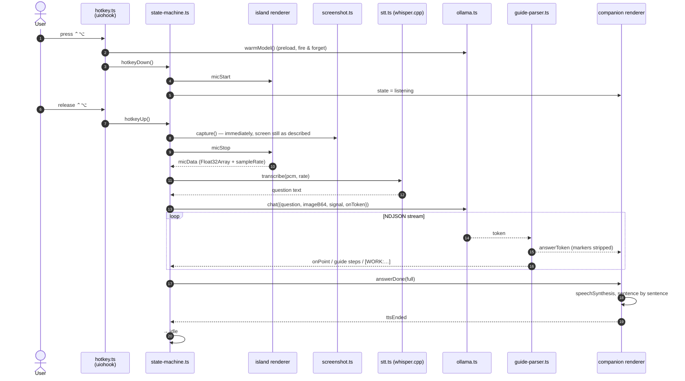
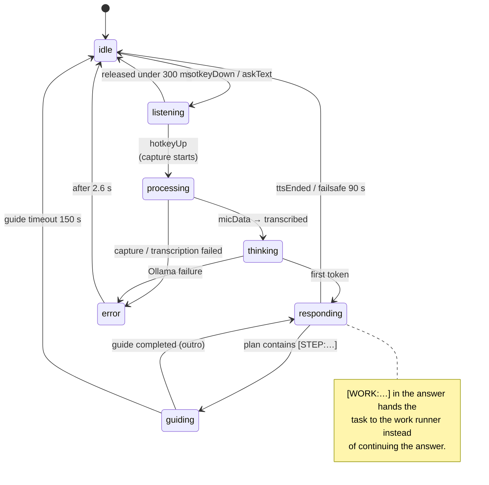
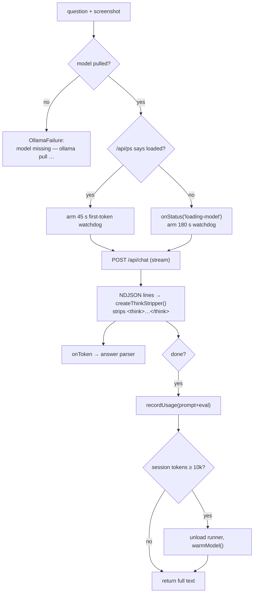

# The voice pipeline

> **Navigation:** [internals hub](README.md) · [brain.yaml](brain.yaml) · related: [internals: pointing](pointing.md), [internals: surfaces](surfaces.md)

Key invariants enforced by `state-machine.ts`:

- **One flight at a time.** A monotonic `seq` counter tags each session; every
  async continuation checks `id === seq` before touching anything.
- **Capture happens on key release**, not after transcription — the screen is
  still in the state the user was describing.
- **`micData` is one-shot per session** (`micSeen === seq` guard): a duplicate
  or late-cancelled mic payload can never start a second run.
- **Minimum hold is 300 ms** (`MIN_HOLD_MS`); shorter presses are discarded.
- Timeouts: 10 s for the mic to deliver, 45 s for transcription, 90 s TTS
  failsafe (`TTS_FAILSAFE_MS`), 4 s error display (`ERROR_MS`).

### Session state machine

`AppPhase` (internal, 6 values) drives `IslandState` (displayed, 8 values) and
`CompanionPose` (drawn, 8 values) — see `shared/state.ts`.

| `AppPhase` | `IslandState` | `CompanionPose` |
| --- | --- | --- |
| `idle` | `idle` | `idle` |
| `listening` | `listening` | `listening` |
| `processing` | `reading` | `reading` (magnifier over a document) |
| `thinking` | `thinking` | `thinking` |
| `responding` | `answering` | `answering` / `pointing` |
| `guiding` | `guiding` | `pointing` |
| — | `acting` | `working` (work runs) |
| — | `error` | `idle` |

### Screen capture

`main/screenshot.ts` — `captureScreenAtCursor()`:

1. `screen.getCursorScreenPoint()` → `screen.getDisplayNearestPoint()`.
2. `desktopCapturer.getSources({types:["screen"], thumbnailSize: display.size})`.
3. Matches the source by `display_id`; falls back to `sources[0]` and records
   `displayMatched: false`.
4. Encodes JPEG quality 90 (inference cost depends on dimensions, not weight).
5. First successful capture flips `screenCaptureConfirmed` in the config — that
   survives the restart macOS demands after granting screen recording.

`displayMatched` is not cosmetic: **Sunflower Work refuses to run** when it is
false, rather than clicking on a display it cannot see.

### Local transcription (Whisper)

`main/stt.ts` wraps `smart-whisper` (N-API binding for whisper.cpp, Metal).

- Model: `ggml-small-q5_1.bin` (~190 MB), downloaded once from
  `huggingface.co/ggerganov/whisper.cpp` into
  `~/Library/Application Support/sunflower/models/`.
- Download is redirect-following (max 5), atomic (`.part` → rename), and
  reports progress 0–100 into `PanelData.stt.progress`.
- Audio is linearly resampled to 16 kHz and padded to at least 1.1 s
  (`MIN_PCM_SAMPLES = 17600`) — whisper.cpp refuses shorter buffers.
- On load, a silent buffer is transcribed as a warm-up.
- `NODE_ENV=production` is forced *only* around the `require`, which installs
  whisper.cpp's silent logger; the previous value is restored immediately.
- `SttStatus`: `ready · loading · downloading · absent · error · disabled`.

Native stderr noise (`whisper_*`, `ggml_*`) is filtered by
`scripts/native-log-filter.cjs` into
`~/Library/Application Support/sunflower/logs/native.log` (rotated at 5 MB).
`SUNFLOWER_DEBUG=1` disables the filter.

### The Ollama client

`main/ollama.ts` talks to `/api/tags`, `/api/ps` and `/api/chat` directly — no
SDK, no server.

| Constant | Value | Why |
| --- | --- | --- |
| `NUM_CTX` | `8192` | screenshot (~600–2500 visual tokens) + prompt + 700 answer tokens. Ollama's 4096 default truncates silently. |
| `NUM_PREDICT` | `700` | 1–3 sentence answers, or a full guide plan (≈450 tokens). |
| `KEEP_ALIVE` | `10m` | keeps the runner warm between questions. |
| `FIRST_TOKEN_WARM_MS` | `45_000` | model already in memory. |
| `FIRST_TOKEN_COLD_MS` | `180_000` | cold load, disk → RAM/VRAM. |
| `INTER_TOKEN_MS` | `30_000` | silence between tokens = failure. |
| `CONTEXT_RESET_TOKENS` | `10_000` | past this, start a fresh chat. |

**Model resolution.** `pickModel()` uses the configured `ollamaModel` if it is
pulled, otherwise **the first local model advertising the `vision`
capability** — the app must work with whatever you already have.

**Cold starts.** `isModelLoaded()` (`GET /api/ps`) decides which first-token
budget to arm and whether to emit `onStatus("loading-model")`, which the
terminal renders as `waking the model…`. `warmModel()` posts an empty
`messages: []` chat (the official Ollama preload pattern), deduplicated and
throttled to once per 30 s, with **the same `num_ctx` as real requests** —
otherwise Ollama restarts the runner on the first real question and the warm-up
is wasted.

**Context renewal.** Each question starts from an empty message list, but the
Ollama runner survives across questions (`keep_alive` + prompt cache), and with
small vision models that accumulated state degrades answers. `recordUsage()`
sums the real `prompt_eval_count + eval_count` Ollama reports; past 10 000
tokens `resetContext()` unloads the runner (`keep_alive: 0`), notifies the
terminal (`✦ … starting a fresh chat`) and re-warms in the background.

Error taxonomy: `OllamaUserInterrupt` (the user aborted — silent) versus
`OllamaFailure` (carries a `userMessage` shown on the island and spoken).

### Answer parsing and markers

`main/guide-parser.ts` is a **streaming** parser: markers never reach the
speech bubble or the voice, even when split across two chunks.

| Marker | Meaning | Handled by |
| --- | --- | --- |
| `[POINT:x1,y1,x2,y2]` | tight bounding box of one element to frame | pointer window |
| `[STEP:x1,y1,x2,y2] text` | guide step, advances on cursor proximity | guide runner |
| `[STEP:x1,y1,x2,y2:click] text` | target not on screen yet, advances on click | guide runner |
| `[STEP:click] text` | no position at all, advances on click | guide runner |
| `[DONE] text` | end of the plan + closing sentence | guide runner |
| `[WORK: description]` | this is an errand, hand it to the work runner | work runner |

**Coordinate normalisation.** The prompt asks for 0–1000 integers (the
grounding format `qwen3-vl` is natively trained on), but `normalizeMarker()`
also accepts:

- legacy two-number centres — `[POINT:50%,30%]` → default fixed frame,
- percentages (`%` suffix),
- 0–1 fractions,
- absolute pixels of the captured image (hence `Screenshot.imageSize`).

What it refuses to do is guess:

- a marker it cannot parse renders **nothing** (`GARBAGE` regex absorbs it),
- a box covering ≥ 85 % of **both** dimensions (`WHOLE_SCREEN_PCT`) is
  discarded as noise,
- a box under 0.4 % in either dimension (`DEGENERATE_PCT`) keeps its centre and
  drops its size,
- the system prompt itself tells the model to skip the marker when unsure.

Guides are capped at 8 steps (`MAX_STEPS`, prompt asks for 6) and 140
characters per spoken instruction (`MAX_STEP_CHARS`).
